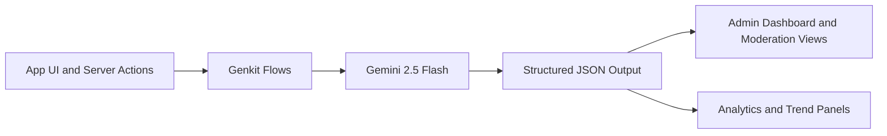
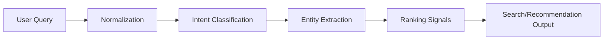
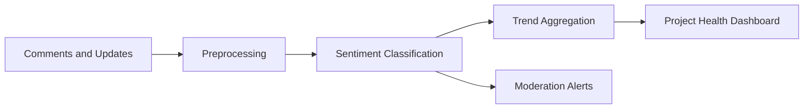

# AI Features

## Overview

blkfndr uses Google Genkit with Gemini 2.5 Flash to support admin and product intelligence workflows. AI capabilities are organized as independent flows so each feature can be tested, versioned, and rolled out safely.

Current and documented flows:

- Listing Quality Analysis (implemented)
- Query Analysis (documented specification)
- Sentiment Tracking (documented specification)

## AI System Architecture



## Setup

### Environment Variables

```bash
GOOGLE_GENERATIVEAI_API_KEY=your_gemini_api_key
```

### Genkit Initialization

File: `src/ai/genkit.ts`

```typescript
import { genkit } from 'genkit';
import { googleAI } from '@genkit-ai/googleai';

export const ai = genkit({
  plugins: [googleAI()],
  model: 'googleai/gemini-2.5-flash',
});
```

### Local Development

```bash
npm run genkit:dev
```

Use the Genkit UI to inspect prompts, validate schemas, and review traces.

## 1. Listing Quality Analysis

### Purpose

Score project listings and provide actionable suggestions and risk flags before admin approval.

### Flow

`improveListingQuality`

File: `src/ai/flows/improve-listing-quality.ts`

### Input Schema

```typescript
interface ImproveListingQualityInput {
  title: string;
  description: string;
  category: string;
  fundingGoal: number;
  imageUrl: string;
}
```

### Output Schema

```typescript
interface ImproveListingQualityOutput {
  suggestions: string[];
  flags: string[];
  overallQualityScore: number; // 0-100
}
```

### Usage Example

```typescript
import { improveListingQuality } from '@/ai/flows/improve-listing-quality';

const result = await improveListingQuality({
  title: 'Community Solar Coop',
  description: 'Launching a neighborhood-owned solar energy initiative...',
  category: 'Climate',
  fundingGoal: 75000,
  imageUrl: 'data:image/png;base64,iVBORw0KGgo...'
});
```

## 2. Query Analysis

### Purpose

Analyze user search queries and listing discovery intent to improve ranking quality, category matching, and recommendation confidence.

### Pipeline



### Input Contract

```typescript
interface QueryAnalysisInput {
  query: string;
  locale?: string;
  userContext?: {
    followedCategories?: string[];
    priorInvestments?: string[];
  };
}
```

### Output Contract

```typescript
interface QueryAnalysisOutput {
  normalizedQuery: string;
  intent: 'discover' | 'compare' | 'fund' | 'research' | 'other';
  entities: Array<{ type: 'category' | 'asset' | 'risk' | 'location'; value: string }>;
  confidence: number; // 0-1
  rankingHints: string[];
}
```

### Server Action Integration Pattern

```typescript
'use server';

import { analyzeQuery } from '@/ai/flows/query-analysis';

export async function analyzeQueryAction(input: QueryAnalysisInput) {
  const analysis = await analyzeQuery(input);
  return {
    ...analysis,
    generatedAt: new Date().toISOString(),
  };
}
```

### UI Guidance

- Display extracted intent near search results.
- Apply ranking hints as soft boosts, not hard filters.
- Hide low-confidence entities from end users and log for review.

## 3. Sentiment Tracking

### Purpose

Classify investor and community sentiment from comments and project updates to surface early risk, momentum, and moderation signals.

### Pipeline



### Input Contract

```typescript
interface SentimentTrackingInput {
  projectId: string;
  messages: Array<{
    id: string;
    authorType: 'creator' | 'investor' | 'admin';
    text: string;
    createdAt: string;
  }>;
}
```

### Output Contract

```typescript
interface SentimentTrackingOutput {
  projectId: string;
  overall: 'positive' | 'neutral' | 'negative';
  score: number; // -1 to +1
  trends: Array<{ window: '24h' | '7d' | '30d'; score: number }>;
  alerts: string[];
}
```

### Aggregation Example

```typescript
function deriveSentimentBadge(score: number): 'positive' | 'neutral' | 'negative' {
  if (score >= 0.2) return 'positive';
  if (score <= -0.2) return 'negative';
  return 'neutral';
}
```

### Dashboard Guidance

- Show a rolling 7-day trend sparkline.
- Highlight abrupt negative shifts with moderation links.
- Combine sentiment with on-chain activity, not in isolation.

## Reliability and Safety

- Enforce Zod schemas for all flow I/O contracts.
- Add retry and fallback responses for provider outages.
- Log prompt version and model version for each execution.
- Avoid moderation auto-actions based only on a single sentiment score.

## Error Handling Example

```typescript
try {
  const result = await improveListingQuality(input);
  return result;
} catch (error) {
  console.error('AI analysis failed:', error);
  return {
    suggestions: [],
    flags: ['AI analysis unavailable - manual review required'],
    overallQualityScore: 0,
  };
}
```

## Rollout Checklist

- [x] Listing quality analysis documented and linked to implementation
- [x] Query analysis contracts and flow pipeline documented
- [x] Sentiment tracking contracts and flow pipeline documented
- [x] Visual diagrams included for all major AI capabilities
