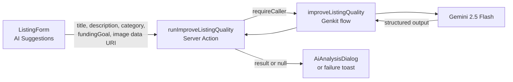
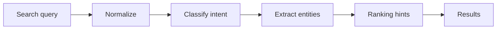
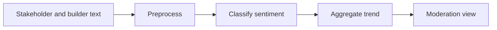

# AI Features

## Overview

blkfndr has one AI feature: an advisory review of a draft listing. On the create-listing form, the **AI Suggestions** button sends the draft to Gemini through a Google Genkit flow. The builder gets back a quality score, suggestions, and any potential issues.

The review is advice for the builder and nothing more. The result is not stored, admins never see it, and it does not gate launch, admin approval, or anything on-chain.

Query analysis and sentiment tracking appear at the end of this page as design specs. Neither is implemented.

| Capability | State |
|---|---|
| Listing quality review (`improveListingQuality`) | Implemented |
| Query analysis | Not implemented — design spec |
| Sentiment tracking | Not implemented — design spec |

## What is implemented

| Piece | File | Role |
|---|---|---|
| Genkit instance | [src/ai/genkit.ts](../src/ai/genkit.ts) | Registers the `googleAI()` plugin and sets the default model |
| Flow | [src/ai/flows/improve-listing-quality.ts](../src/ai/flows/improve-listing-quality.ts) | Schemas, the prompt `improveListingQualityPrompt`, the flow `improveListingQualityFlow`, and the exported wrapper `improveListingQuality()` |
| Server Action | [src/app/actions.ts](../src/app/actions.ts) | `runImproveListingQuality()`, the only caller of the flow |
| Form | [src/components/create/ListingForm.tsx](../src/components/create/ListingForm.tsx) | The **AI Suggestions** button on `/create-listing` |
| Result dialog | [src/components/create/AiAnalysisDialog.tsx](../src/components/create/AiAnalysisDialog.tsx) | Shows the score, suggestions and issues |
| Dev entry point | [src/ai/dev.ts](../src/ai/dev.ts) | Loads `.env` and registers the flow for the Genkit Developer UI |

### Request path


```mermaid
flowchart LR
    A[ListingForm<br/>AI Suggestions] -->|title, description, category,<br/>fundingGoal, image data URI| B[runImproveListingQuality<br/>Server Action]
    B -->|requireCaller| C[improveListingQuality<br/>Genkit flow]
    C --> D[Gemini 2.5 Flash]
    D -->|structured output| C
    C --> B
    B -->|result or null| E[AiAnalysisDialog<br/>or failure toast]
```

1. The builder picks a project image. The browser reads it into a base64 data URI. Without an image, the button shows "Image Required" and sends nothing.
2. The form sends the title, description, category, funding goal and image data URI to `runImproveListingQuality`.
3. The action calls `requireCaller()`, because every call is billed. A signed-out caller gets `null`.
4. The flow fills the prompt, attaches the image as media, and asks the model for output that matches the output schema.
5. Any error is logged on the server as `AI analysis failed:` and returned as `null`. That covers a missing key, a provider failure and output that does not fit the schema. The form then shows "AI Analysis Failed".
6. On success, the dialog shows the score as a progress bar and `N/100`, then the suggestions. It shows a "Potential Issues" list only when `flags` is non-empty.

## Schemas

Copied from [src/ai/flows/improve-listing-quality.ts](../src/ai/flows/improve-listing-quality.ts). `z` is the zod instance that `genkit` re-exports.

### Input

```typescript
const ImproveListingQualityInputSchema = z.object({
  title: z.string().describe('The title of the project listing.'),
  description: z.string().describe('The detailed description of the project.'),
  category: z.string().describe('The category the project belongs to (e.g., Technology, Art, Charity).'),
  fundingGoal: z.number().describe('The total funding amount being sought for the project.'),
  imageUrl: z.string().describe("URL for an image representing the project, as a data URI that must include a MIME type and use Base64 encoding. Expected format: 'data:<mimetype>;base64,<encoded_data>'."),
});
```

What the form actually sends:

| Field | Source |
|---|---|
| `title`, `description` | The form fields as typed |
| `category` | The category picked from the form's list |
| `fundingGoal` | The form's goal, which is the sum of the milestone amounts. Whole token units, not stroops |
| `imageUrl` | A `data:` URI read from the selected file. Never an IPFS URL — the image is pinned to IPFS only at launch |

### Output

```typescript
const ImproveListingQualityOutputSchema = z.object({
  suggestions: z.array(
    z.string().describe('Specific suggestions for improving the listing.')
  ).describe('A list of AI-powered suggestions to enhance the project listing.'),
  flags: z.array(
    z.string().describe('Potential issues or concerns identified in the listing.')
  ).describe('A list of potential issues or concerns that need review.'),
  overallQualityScore: z.number().describe('An overall quality score (0-100) for the listing based on AI analysis.'),
});
```

The 0–100 range is a description for the model. The schema does not enforce it.

## Model and configuration

| Setting | Value |
|---|---|
| Model | `googleai/gemini-2.5-flash`, the Genkit default set in [src/ai/genkit.ts](../src/ai/genkit.ts). The prompt does not override it |
| Packages | `genkit` and `@genkit-ai/googleai`, plus `genkit-cli` for development |
| Bundling | [next.config.js](../next.config.js) lists the Genkit packages in `serverExternalPackages`. They load only on the server |
| API key | `GEMINI_API_KEY`. The plugin also accepts `GOOGLE_API_KEY` or `GOOGLE_GENAI_API_KEY`. Server-only — never prefix it `NEXT_PUBLIC_` |

The old name `GOOGLE_GENERATIVEAI_API_KEY` is not read by anything.

In Docker, [docker-compose.yml](../docker-compose.yml) passes `GEMINI_API_KEY` to the app container at runtime. It is not a build argument, so setting or changing it needs a redeploy, not a rebuild.

### When `GEMINI_API_KEY` is unset

The app starts and the flow module imports normally. Each call then fails with:

```
FAILED_PRECONDITION: Please pass in the API key or set the GEMINI_API_KEY or GOOGLE_API_KEY environment variable.
```

The action catches this and returns `null`, so the builder sees "AI Analysis Failed". Nothing else in the app depends on the feature.

### Limits

- **Sign-in only.** There is no other rate limit or quota in the app.
- **Image size.** The image travels as base64 inside the Server Action request. Next.js caps Server Action bodies at 1 MB by default, and [next.config.js](../next.config.js) does not raise it. Base64 adds a third, so an image over roughly 750 KB pushes the request over the cap. Next.js refuses it with a 413 before the action runs.
- **No retry and no fallback.** One failed model call is one failed review.

## Local development

```bash
npm run genkit:dev     # genkit start -- tsx src/ai/dev.ts
npm run genkit:watch   # the same, restarting on file changes
```

This starts the Genkit Developer UI. In it you can run `improveListingQualityFlow` with your own input, check it against the schemas, and inspect traces.

- [src/ai/dev.ts](../src/ai/dev.ts) calls dotenv's `config()`, which loads `.env` from the repo root, not `.env.local`. For the Developer UI, put `GEMINI_API_KEY` in `.env` or export it in your shell. `npm run dev` reads `.env.local` as usual.
- On first run the Genkit CLI shows a Google analytics and cookies notice and waits for Enter. `genkit config set analyticsOptOut true` opts out.
- `tsx` is not a direct dependency. It is installed with `genkit-cli`.

## Adding a flow

1. Create a file in `src/ai/flows/`. Define the input and output schemas with `z` from `genkit`, the prompt with `ai.definePrompt()`, the flow with `ai.defineFlow()`, and export an async wrapper.
2. Import the file in [src/ai/dev.ts](../src/ai/dev.ts) so the Developer UI can see it.
3. Expose it only through a guarded Server Action or route handler, the way `runImproveListingQuality` does. Every exported async function in a `"use server"` file is a public endpoint, so the wrapper authenticates the caller, validates its input, and catches errors.
4. Never import a flow into a client component.

---

## Design specs (not implemented)

These sections describe possible features. None of the flows, files or contracts below exist in the codebase.

### Query analysis

**Not implemented — design spec.**

**Today:** search is a case-insensitive substring match, with no model involved. The header search ([src/components/layout/HeaderSearch.tsx](../src/components/layout/HeaderSearch.tsx)) loads `/api/projects` and matches each project's title and tagline. The `/projects?q=` page ([src/app/projects/page.tsx](../src/app/projects/page.tsx)) also matches the description.

**Purpose:** read the intent behind a search, such as a category, a place or a risk concern, so results rank by what the person meant rather than by literal text.


```mermaid
flowchart LR
    Q[Search query] --> N[Normalize]
    N --> I[Classify intent]
    I --> E[Extract entities]
    E --> R[Ranking hints]
    R --> O[Results]
```

Proposed contracts:

```typescript
interface QueryAnalysisInput {
  query: string;
  locale?: string;
}

interface QueryAnalysisOutput {
  normalizedQuery: string;
  intent: 'discover' | 'compare' | 'stake' | 'research' | 'other';
  entities: Array<{ type: 'category' | 'location' | 'risk'; value: string }>;
  confidence: number; // 0-1
  rankingHints: string[];
}
```

Guidance:

- Run it behind a guarded Server Action, like the listing review.
- Apply ranking hints as soft boosts, never as filters, so a bad answer cannot hide a project.
- Drop low-confidence entities instead of showing them.

### Sentiment tracking

**Not implemented — design spec.**

**Today:** the platform has no comments or project-update feed, so there is no text to classify yet. The nearest sources are milestone proof text and community feature requests.

**Purpose:** summarize how stakeholders feel about a project over time, as one signal for moderators alongside on-chain activity.


```mermaid
flowchart LR
    C[Stakeholder and builder text] --> P[Preprocess]
    P --> S[Classify sentiment]
    S --> T[Aggregate trend]
    T --> D[Moderation view]
```

Proposed contracts:

```typescript
interface SentimentTrackingInput {
  projectId: string;
  messages: Array<{
    id: string;
    authorRole: 'builder' | 'stakeholder' | 'admin';
    text: string;
    createdAt: string;
  }>;
}

interface SentimentTrackingOutput {
  projectId: string;
  overall: 'positive' | 'neutral' | 'negative';
  score: number; // -1 to +1
  trends: Array<{ window: '24h' | '7d' | '30d'; score: number }>;
  alerts: string[];
}
```

Guidance:

- Read it next to on-chain activity, never on its own.
- Never take a moderation action, such as hiding or locking a project, from a sentiment score alone. Those stay with the admins.
- Sentiment has no part in votes or releases. Those are decided by stakeholders on-chain.
