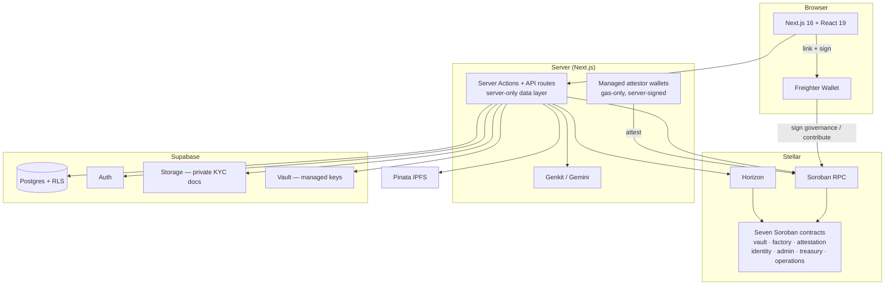

# Architecture

## System overview

blkfndr is a full-stack decentralized application on Stellar. Everything that **holds or moves value** lives in Soroban smart contracts with no platform key in the path; everything else — listings, identity review, moderation, notifications — is a conventional web app over Supabase. The split is deliberate: the contracts are the part you should not have to trust anyone about, so they are kept minimal and keyless, and the app is a convenience and moderation layer around them.



## The three planes

1. **On-chain (value and record).** The seven contracts described in [Smart Contracts](smart-contracts.md). A project's stakes and the builder's bond live in its vault; releases happen on a stakeholder vote; the outcome is written to an append-only registry. Fees pool in the treasury; the Operations Vault holds the platform's gas budget.
2. **Off-chain app (Supabase).** Postgres with Row Level Security holds project-listing metadata, user profiles, notifications, KYC records and roles. Auth issues sessions; Storage holds identity documents in a private bucket; Vault holds the managed attestor keys. **On-chain state remains the source of truth for who is a platform admin and for anything involving money.**
3. **Identity/moderation bridge.** A thin server layer connects the two: it signs KYC attestations with managed, gas-only wallets, runs the AI listing review, and drives the time-gated gas transfers the contracts expose.

## Data flow

### Project creation → vault deployment
```
Builder fills the listing → media pinned to IPFS (Pinata) → listing metadata saved to Supabase
    → factory.create_vault(config) → Freighter signs → RPC submits
    → vault instantiated from the audited wasm hash; bond + flat fee taken in the same tx
```

### Staking (KYC-gated)
```
Stakeholder connects Freighter → identity registry checked (is_kyc_approved)
    → vault.contribute(addr, amount), amount ≥ min → weight recorded (capped at 20%)
```

### Milestone release (permissionless)
```
Builder opens a milestone vote → stakeholders approve_milestone (weighted)
    → once >50% of the raise has approved, ANYONE calls release_milestone → tranche pays out
A window that lapses without carrying → settle_lapsed_milestone → funds + bond become claimable
```

### Close → permanent record
```
Final milestone or failure → vault writes {builder, outcome, raise, bond, milestones, timestamp}
    to blkfndr-attestation — append-only, no edit, no delete
```

### Governance and the gas economy
```
Flat fees pool in blkfndr-treasury
Owners vote (two-thirds by headcount) → distributions to shareholders and policy changes
Owners vote SetOpsFunding once → treasury.fund_operations() moves a % of unreserved XLM
    to the Operations Vault every 30 days, permissionlessly (driven by POST /api/ops-funding)
Ops-vault owners vote ReleaseMany → tops up every active managed attestor wallet at once
```

### AI listing-quality review
```
Draft listing (title, description, goal, media) → Genkit flow → Gemini 2.5 Flash
    → suggestions[], flags[], score(0-100) shown to the reviewer alongside the listing
```

## Layers

### Frontend — Next.js 16 / React 19
App Router, TailwindCSS, shadcn/ui. React Context providers for auth, blockchain data and currency. Freighter is used for wallet linking, for staking, and for owners to sign governance proposals. Generated contract bindings live in `src/packages/`.

### Server — actions and API routes
Every exported async function in a `"use server"` file is a public HTTP endpoint, so each one **re-authenticates, re-authorizes, and validates its arguments** — the argument list is treated as hostile. The server-only data-access layer under `src/lib/data/` is the only place the service-role key is used, and it is unreachable from the browser. REST routes include `POST /api/indexer` and `POST /api/ops-funding`, both bearer-gated by `INDEXER_SECRET`.

### Data — Supabase (Postgres + RLS)
Authorization is enforced by the database, not only by application code. Every table carries Row Level Security. The identity columns on `kyc_requests` are granted to **no browser-facing role at all**, so `select *` on your own row fails with a publishable key; those columns are reachable only with the service-role key, from `server-only` modules, after an explicit admin check. Identity documents live in a **private Storage bucket** behind short-lived signed URLs minted server-side. Managed attestor keys live in **Supabase Vault** behind service-role-only functions. (MongoDB is being removed collection by collection as each call site moves to Postgres.)

### Smart contracts — Soroban
Seven Rust/WASM contracts; see [Smart Contracts](smart-contracts.md) for the full API. Interaction is via Soroban RPC (`simulateTransaction` → `sendTransaction`); Horizon provides indexed reads.

### AI — Genkit + Gemini
Type-safe flows in `src/ai/flows/`, registered with `ai.defineFlow()`, running on Gemini 2.5 Flash. The current flow scores a draft listing for quality before it goes live. Without `GEMINI_API_KEY` the feature is simply off.

## Roles — the four groups

Roles are read from `app_metadata` (which a user cannot edit), never `user_metadata`. Role labels use platform language; the enum names are in parentheses.

| Group | On-chain? | Wallet | What they can do |
|---|---|---|---|
| **Owners** | Treasury / Operations Vault owners | Own Freighter | Hold a share and vote (two-thirds by headcount) on distributions and platform policy |
| **Platform Administrators** (`platform_admin`) | `blkfndr-admin` roster | — | Run the platform: review KYC, moderate listings, ban users, read platform health. **No stake, no vote, not in the money path** |
| **KYC Attestors** (`kyc_manager`) | Named in `blkfndr-identity` | Managed, gas-only | Approve/revoke KYC. The server signs `attest` with their managed key — they never touch a wallet |
| **Project Administrators** (`project_approver`) | — | — | Flag and approve listings. Pure Supabase/RLS, entirely off-chain |

The distinction between owners and platform administrators is load-bearing: **owning the platform and running it are different jobs.** Staff who need console access are `platform_admin` and never appear in the treasury's owner set; adding an owner is a financial decision (it dilutes the others) and only happens through a `SetOwners` vote.

## Managed moderator wallets

Hiring non-web3 moderators means they cannot be expected to hold or sign for a wallet. So each KYC attestor gets a **platform-generated, gas-only wallet**:

- **Generated** when the role is assigned; the private key is stored in **Supabase Vault** (service-role-only `set/get/delete_managed_key`, *not* granted to `authenticated`).
- **Server-signed.** KYC approval calls `attest` signed by the reviewer's managed key — the console never surfaces Freighter for it.
- **Gas-only by contract.** The identity contract lets an attestor key call only `attest`/`revoke`. It never custodies project funds.
- **Swept on removal.** Unassigning the role sweeps the wallet's balance back to the **Operations Vault** via a native-SAC transfer and deletes the key. One irreducible caveat: the ~1 XLM base reserve every classic account locks cannot return to a contract (`account-merge` needs a classic destination), so that dust is intentionally left behind.

Appointment (`add_attestor` / `remove_attestor`) stays **owner-signed via Freighter** on purpose — handing the server the registry-admin key would also hand it `set_admin` power.

## Governance and the gas economy

There is no cron on Soroban, so the "monthly" transfers are **permissionless, time-gated triggers** that any caller (here, an indexer cron hitting `POST /api/ops-funding`) can fire once the 30-day gate opens:

1. Flat listing fees pool in the **treasury**.
2. Owners vote **once** to set the ops-funding cut (`SetOpsFunding`: destination vault, XLM, a percentage).
3. `treasury.fund_operations()` thereafter moves that percentage of the **unreserved** XLM to the **Operations Vault** every 30 days — never touching money owed to a shareholder, and refusing while a distribution cycle is mid-vote.
4. Ops-vault owners vote `ReleaseMany` to top up **every active managed attestor wallet** in one carried vote.

No owner key ever signs a transfer: a carried vote is the authority, and execution is permissionless.

## Security model

- **Authorization in the database.** RLS on every table; KYC identity columns write-only to browser roles; identity docs in a private bucket via signed URLs; managed keys in Vault behind service-role-only functions.
- **Roles from `app_metadata`,** with on-chain state as the source of truth for platform-admin.
- **Hostile-argument server actions.** Every `"use server"` export re-authenticates, authorizes and validates.
- **No secret is ever `NEXT_PUBLIC_`.** Anything so prefixed is inlined into the browser bundle at build time. `SUPABASE_SECRET_KEY`, `PINATA_JWT`, `INDEXER_SECRET` and `OPS_FUNDING_SUBMITTER_SECRET` are server-only.
- **No admin key in the money path.** The most important property, enforced by the contracts rather than by policy.

## Directory structure

```
blkfndrapp/
├── contracts/                  # Seven Soroban contracts (Rust)
│   ├── blkfndr-vault/          # Per-project bonded vault
│   ├── blkfndr-factory/        # Vault deployment + pinned addresses
│   ├── blkfndr-attestation/    # Append-only builder record
│   ├── blkfndr-identity/       # KYC attestation registry
│   ├── blkfndr-admin/          # Platform-admin roster
│   ├── blkfndr-treasury/       # Fee treasury + owner-voted governance
│   └── blkfndr-operations/     # Operations Vault: governed gas budget
├── supabase/migrations/        # Tracked SQL: schema + RLS
├── scripts/
│   ├── build-contracts.sh      # Builds wasm, prints sha256 hashes
│   └── deploy-contracts.sh     # Deploys and wires the suite, verifying the result
├── src/
│   ├── ai/                     # Genkit flows and configuration
│   ├── app/                    # App Router pages + API routes (auth/, api/)
│   ├── components/             # React components (shadcn/ui; admin/, home/, project/…)
│   ├── context/                # React Context providers
│   ├── hooks/                  # Custom hooks
│   ├── lib/
│   │   ├── auth/               # Authorization guards
│   │   ├── data/               # Server-only data-access layer (service role)
│   │   ├── supabase/           # Client setup + generated DB types
│   │   ├── managed-wallet.ts   # Managed attestor-key core (server-only)
│   │   └── ops-funding.ts      # Monthly treasury→ops trigger
│   ├── packages/               # Generated contract bindings
│   └── proxy.ts                # Session refresh (not a security boundary)
├── docs/
├── docker-compose.yml
└── Dockerfile
```

## Key design decisions

- **Supabase over MongoDB + NextAuth.** Row Level Security lets authorization be enforced by the database itself, which is what allows KYC PII columns to be genuinely unreadable from the browser rather than merely hidden by application code.
- **Stellar / Soroban.** Sub-cent fees and ~5-second finality make per-milestone, per-vote on-chain actions economical, and the native Stellar Asset Contract lets a contract create and fund a fresh account — which is what makes gas-only managed wallets and permissionless releases possible.
- **Permissionless execution everywhere value moves.** A carried vote is the authority; anyone can submit the transaction. There is no appointed signer to chase and no one who can withhold a decision already made.
- **Append-only history.** The attestation registry has no update or delete entrypoint, so a builder's track record cannot be edited before their next raise.
- **Keyless money path.** Fees and gas are governed by vote; project funds move only on stakeholder votes. The platform's power is confined to moderation and identity, which hold no value.
