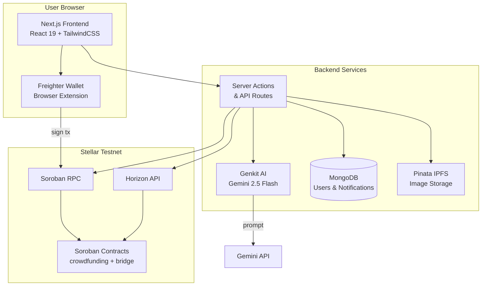

# Architecture

## System Overview

blkfndr is a full-stack decentralized application (dApp) built on the Stellar blockchain. The system connects a Next.js frontend with Soroban smart contracts through the Soroban RPC and Horizon API, backed by MongoDB for off-chain data and Pinata IPFS for decentralized file storage.



## Data Flow

### 1. Project Creation

```
Creator fills form → Image uploaded to Pinata → IPFS hash returned
    → Soroban tx built (create_project) → Freighter signs → RPC submits
    → Contract stores project → Horizon indexes → Admin reviews
```

### 2. Admin Approval

```
Admin views pending projects → AI quality analysis runs (Genkit)
    → Admin approves/rejects → Multi-sig tx signed → Contract updates status
    → Project appears in public listings
```

### 3. Project Funding

```
Investor selects project + amount + currency → Soroban tx built (fund_project)
    → Freighter signs → RPC submits → Contract transfers funds
    → Investment Receipt SBT minted → MongoDB notification created
```

### 4. Fund Claiming (Creator)

```
Project reaches goal → Creator initiates claim → Multi-sig admin proposes withdrawal
    → Admins vote → Threshold met → Funds transferred to creator wallet
    → Platform fee sent to fee wallet
```

### 5. AI Listing Quality Analysis

```
Listing data (title, description, category, goal, image) → Genkit flow
    → Gemini 2.5 Flash analyzes → Returns suggestions[], flags[], score (0-100)
    → Admin reviews AI output alongside listing
```

## Layer Descriptions

### Frontend (Next.js)

- **Framework**: Next.js 16 with App Router
- **UI**: React 19, TailwindCSS, shadcn/ui component library
- **State**: React Context providers for auth, blockchain data, currency preferences
- **Wallet Integration**: Freighter browser extension for transaction signing
- **Styling**: Dark blue (#003049) primary, steel white (#F0F4F7) background, red-orange (#D62828) accent

### Smart Contracts (Soroban)

- **Language**: Rust compiled to WASM
- **Contracts**:
  - `crowdfunding` — Core platform logic (projects, funding, admin governance)
  - `bridge/` — Token wrappers for USDC, USDT, WBTC, WETH
- **Network**: Stellar Testnet
- **Interaction**: Via Soroban RPC (`simulateTransaction` → `sendTransaction`)

### Data Layer

- **On-chain**: All project, investment, and governance state lives in Soroban contract storage
- **Off-chain (MongoDB)**: User profiles, notification history, session data
- **File Storage (Pinata IPFS)**: Project images and metadata blobs
- **Indexing**: Horizon API provides queryable views of on-chain data

### AI Layer (Genkit)

- **Framework**: Google Genkit with Gemini 2.5 Flash model
- **Flows**: Defined in `src/ai/flows/`, registered with Genkit
- **Current Flow**: `improveListingQuality` — analyzes project listings for quality scoring
- **Extensibility**: New flows can be added by defining prompts and registering with `ai.defineFlow()`

### Authentication

- **Primary**: Stellar Freighter wallet (public key authentication)
- **Session**: NextAuth with MongoDB adapter
- **User Identity**: Derived from Freighter public key, linked to MongoDB user profile

## Directory Structure

```
blkfndr/
├── src/
│   ├── ai/                    # Genkit AI configuration & flows
│   │   ├── genkit.ts          # Genkit init with Gemini plugin
│   │   ├── dev.ts             # Genkit dev server entry
│   │   └── flows/             # AI flow definitions
│   │       └── improve-listing-quality.ts
│   ├── actions/               # Next.js Server Actions
│   │   └── notifications.ts   # Notification CRUD
│   ├── app/                   # App Router pages & API routes
│   │   ├── layout.tsx         # Root layout
│   │   ├── page.tsx           # Home page (project listings)
│   │   ├── admin/             # Admin dashboard
│   │   ├── api/               # REST API endpoints
│   │   ├── create-listing/    # Project creation form
│   │   ├── login/             # Authentication page
│   │   ├── profile/           # User profile & investments
│   │   ├── projects/          # Project detail & funding
│   │   ├── settings/          # User & platform settings
│   │   └── testing/           # Admin testing utilities
│   ├── components/            # Reusable React components
│   │   ├── ui/                # shadcn/ui primitives
│   │   ├── admin/             # Admin-specific components
│   │   ├── auth/              # Authentication components
│   │   ├── create/            # Listing creation components
│   │   ├── home/              # Homepage components
│   │   ├── layout/            # Layout components (header, footer)
│   │   ├── profile/           # Profile components
│   │   ├── project/           # Project display components
│   │   ├── settings/          # Settings components
│   │   └── wallet/            # Wallet connection components
│   ├── context/               # React Context providers
│   │   ├── AuthContext.tsx     # Authentication state
│   │   ├── BlockchainContext.tsx # On-chain data
│   │   ├── CurrencyContext.tsx # Currency preferences
│   │   └── ProjectDetailsContext.tsx # Active project state
│   ├── hooks/                 # Custom React hooks
│   │   ├── use-tx.ts          # Transaction building & signing
│   │   ├── use-zklogin.ts     # Legacy zkLogin (deprecated)
│   │   └── use-toast.ts       # Toast notifications
│   └── lib/                   # Core utilities
│       ├── contract.ts        # Soroban contract interactions
│       ├── data.ts            # Server-side data layer
│       ├── data.client.ts     # Client-side data layer
│       ├── mongodb.ts         # MongoDB connection
│       ├── pinata-client.ts   # Pinata IPFS client
│       ├── graphql-client.ts  # GraphQL client (deprecated)
│       ├── graphql-queries.ts # GraphQL query definitions (deprecated)
│       ├── graphql-types.ts   # GraphQL type definitions (deprecated)
│       ├── types.ts           # Shared TypeScript types
│       ├── utils.ts           # General utilities
│       ├── formatters.tsx     # Display formatters
│       ├── categories.ts      # Project categories
│       ├── authOptions.ts     # NextAuth configuration
│       └── auth/              # Auth utilities
├── blkfndr/                   # Soroban smart contracts
│   ├── Move.toml              # Contract manifest
│   └── sources/
│       └── blkfndr.move       # Crowdfunding contract
├── bridge/                    # Token bridge contracts
│   ├── Move.toml
│   └── sources/
│       ├── usdc.move
│       ├── usdt.move
│       ├── wbtc.move
│       └── weth.move
├── docs/                      # Documentation (you are here)
├── public/                    # Static assets
├── docker-compose.yml         # Docker Compose config
├── Dockerfile                 # Multi-stage Docker build
└── package.json               # Dependencies & scripts
```

## Key Design Decisions

### Why Stellar / Soroban?
- **Low transaction fees** — fractions of a cent per transaction
- **Fast finality** — ~5 second confirmation times
- **Built-in DEX** — native asset swapping without external protocols
- **Soroban** — Rust-based smart contracts with WASM runtime, familiar for systems programmers
- **Horizon API** — RESTful indexing for querying on-chain state without running a node

### Why Freighter Wallet?
- Purpose-built for Stellar dApps and DeFi
- Seamless Soroban transaction signing
- Widely adopted in the Stellar ecosystem
- Open-source and audited

### Why Pinata IPFS?
- Decentralized, content-addressed file storage
- Immediate IPFS hash return (no async polling)
- Reliable gateway infrastructure
- Simple REST API and SDK

### Why Genkit + Gemini?
- Type-safe AI flow definitions with Zod schemas
- Tight integration with Next.js (server actions)
- Gemini 2.5 Flash offers fast, cost-effective inference
- Extensible — new flows can be added without restructuring