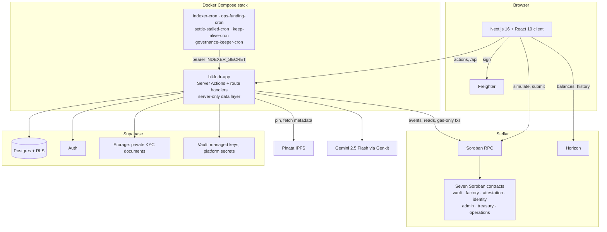

# Architecture

## System overview

blkfndr is a secure, non-custodial vault for real-world projects on Stellar. Everything that **holds or moves value** lives in Soroban smart contracts with no platform key in the path. Everything else (listings, identity review, moderation, notifications) is a conventional web app over Supabase. The split is deliberate. The contracts are the part nobody should have to trust anyone about, so they are kept small and keyless. The app is a convenience and moderation layer around them, and the ledger stays the source of truth for anything involving money.


```mermaid
graph TB
    subgraph Browser
        UI[Next.js 16 + React 19 client]
        FW[Freighter]
    end

    subgraph "Docker Compose stack"
        APP[blkfndr-app<br/>Server Actions + route handlers<br/>server-only data layer]
        CRON[indexer-cron · ops-funding-cron<br/>settle-stalled-cron · keep-alive-cron<br/>governance-keeper-cron]
    end

    subgraph Stellar
        SRPC[Soroban RPC]
        HZN[Horizon]
        SUITE[Seven Soroban contracts<br/>vault · factory · attestation · identity<br/>admin · treasury · operations]
    end

    subgraph Supabase
        PG[(Postgres + RLS)]
        AUTH[Auth]
        STG[Storage: private KYC documents]
        SV[Vault: managed keys, platform secrets]
    end

    PIN[Pinata IPFS]
    GEM[Gemini 2.5 Flash via Genkit]

    UI -->|actions, /api| APP
    UI -->|sign| FW
    UI -->|simulate, submit| SRPC
    UI -->|balances, history| HZN
    CRON -->|bearer INDEXER_SECRET| APP
    APP --> PG
    APP --> AUTH
    APP --> STG
    APP --> SV
    APP -->|pin, fetch metadata| PIN
    APP --> GEM
    APP -->|events, reads, gas-only txs| SRPC
    SRPC --> SUITE
```

The browser never talks to Supabase directly: there is no Supabase client in the client bundle. It reaches the database only through server actions and route handlers. It does talk to the chain directly. It simulates and submits contract calls over Soroban RPC, and it reads balances and history from Horizon.

## The three planes

1. **On-chain (value and record).** The seven contracts in [Smart Contracts](smart-contracts.md). A project's stakes and the builder's bond sit in its vault. Releases happen on a stakeholder vote, and the outcome is written to an append-only registry. Flat listing fees pool in the treasury. The Operations Vault holds the platform's gas budget.
2. **Off-chain app (Supabase).** Postgres with Row Level Security holds listing metadata, profiles, notifications, KYC records, the admin roster and moderation state. Auth issues sessions. Storage holds identity documents in a private bucket. Supabase Vault holds managed attestor keys and platform secrets.
3. **The bridge.** A thin server layer connects the two. The indexer mirrors chain events into Postgres. The server signs KYC attestations with managed, gas-only keys, and three scheduled jobs press the permissionless, time-gated buttons the contracts expose.

## Data flow

### Launching a vault

The launch runs in the builder's browser ([ListingForm.tsx](../src/components/create/ListingForm.tsx)), in this order:

1. **Validation.** A zod schema plus an explicit milestone check. Anything that blocks the launch opens `LaunchBlockedDialog` rather than failing silently.
2. **Identity.** `is_kyc_approved(builder)` is simulated on the identity registry. A builder without an attestation is sent to `/profile/kyc-attestation`. The vault checks this again on chain.
3. **Bond pre-flight** ([src/lib/bond-readiness.ts](../src/lib/bond-readiness.ts)). The vault takes the bond in the same call that creates it, so the app checks first. It asks the token contract which asset it is, then loads the builder's account from Horizon. A missing account, a missing trustline or a balance below the bond opens `BondBlockerDialog`. A network error fails open.
4. **Uploads.** The image and the listing metadata JSON are pinned through `/api/upload-image`. The CIDs are kept, so a retry of the same draft reuses them.
5. **Duplicate guard** ([src/lib/vault-deploy-guard.ts](../src/lib/vault-deploy-guard.ts)). The five newest factory projects are read back. If one has the same creator and metadata CID, it is shown and nothing is signed. This fails closed: if the factory cannot be read, nothing is sent.
6. **Review.** `create_vault` is simulated and the platform fee read. `LaunchReviewDialog` shows the goal, the bond, the flat fee and the simulated network fee. Cancelling signs nothing.
7. **Sign and send.** Freighter signs, the transaction is sent, and the builder is taken to `/projects`. The browser writes nothing to the database. The listing appears when the indexer handles `FACTORY/DEPLOY`.
8. **Sent but unconfirmed.** If the confirmation fails after the transaction reached the network, `resolveSubmittedLaunch` polls `getTransaction` until it succeeds, fails, or passes its `maxTime` plus 15 seconds. `SUCCESS` is announced as a launch. `EXPIRED` means nothing was applied and a retry is safe. `UNKNOWN` (RPC unreachable) links to the transaction; a retry is still covered by step 5.

On chain, `factory.create_vault` requires the builder's signature, a positive goal, at least one milestone, a future deadline and a bond of at least the factory's minimum (5% of the goal by default). It deploys the vault from the factory's stored `VaultWasmHash`. The vault's `initialize` checks the builder's KYC, moves the bond into the vault and the flat fee to the fee wallet (the treasury), both from the builder. The factory then emits `FACTORY/DEPLOY`.

### Staking

```
Stakeholder connects Freighter (contributors are not identity-checked; see M-01 in progress.md)
    → the app asks checkVaultLockAction; a locked project gets no transaction built
    → vault.contribute(address, amount), amount ≥ the vault's minimum, no fee deducted
    → reaching the goal moves the vault to Funded, closes contributions and starts the 90-day stall clock
```

### Milestone proof, vote and release

```
Builder attaches proof to a milestone in the project dialog → submitMilestoneProof (server action)
Builder opens the vote → vault.open_milestone_vote (builder-signed; not built while locked)
Stakeholders vote inside the window → vault.approve_milestone (weight capped at 20% of the raise)
Once the vote carries → ANYONE calls release_milestone → the tranche goes to the builder
A window that closes without carrying → settle_lapsed_milestone → Refunding; the bond is forfeited
    and refunded pro rata with the stakes through claim_refund
90 days since funding or the last release, no window open → settle_stalled → Refunding, same terms
```

Proof is off-chain evidence, one per milestone ([MilestoneProof.tsx](../src/components/project/MilestoneProof.tsx)). `submitMilestoneProof` reads the live vault, not the indexed copy, and accepts proof only from the vault's builder (or an admin), only while the vault is `funded` or `active`, and only for a milestone that is neither released nor failed. A proof is a JSON document of at most 4,000 characters, and a photo is PNG, JPEG, WebP or GIF of 8 MB or less. A database trigger refuses proof while the project is locked. Each submission notifies the admins who look after projects.

The rule a vote must meet is in [The vault release rule](#the-vault-release-rule).

### Close → permanent record

When a vault closes, it writes one record to `blkfndr-attestation`: the vault, the factory, the builder, the project id, the outcome, the amount raised, the bond, and how many milestones there were and how many were released. The registry stamps `closed_at`. The outcome is `Completed` (every milestone released, bond returned), `FailedToFund` (the raise missed its goal) or `FailedWithForfeiture` (a lapsed or stalled milestone). The registry has no update or delete entrypoint.

### Chain → database

The site reads Postgres, not the chain, so listings and figures lag the ledger by up to one indexer pass (60 seconds by default). See [The event indexer](#the-event-indexer).

After a transaction the client calls `triggerIndexerSync`. That action runs only for someone on the admin roster; for everyone else it returns a refusal and the change waits for the next scheduled pass.

### AI listing review

```
Builder presses Analyze on the create form → runImproveListingQuality (signed in only)
    → Genkit flow on Gemini 2.5 Flash → { suggestions[], flags[], overallQualityScore (0-100) }
    → shown to the builder in a dialog
```

The flow is in [src/ai/flows/improve-listing-quality.ts](../src/ai/flows/improve-listing-quality.ts). Without `GEMINI_API_KEY` it returns nothing and the feature is off.

## The event indexer

[src/lib/event-indexer.ts](../src/lib/event-indexer.ts) mirrors contract events into Postgres. `runIndexer()` is called by `POST /api/indexer` (from `indexer-cron`) and by `triggerIndexerSync` (admins). Every write goes through the service role.

**Where it starts.** It reads the cursor (`indexer_state.last_processed_ledger`) and starts one ledger after it, or 10,000 ledgers back on a cold start. RPC only serves events inside its retention window, so a start before the RPC's `oldestLedger` is moved up to that ledger instead of failing.

**What it scans.** The factory plus every `vault_address` in `projects`, in groups of five per `getEvents` filter, 200 events per page. The RPC scans a bounded window of about 10,000 ledgers per request, and an empty window returns no events but a cursor at its end. So an empty page does not mean "caught up". The indexer follows the RPC's cursor, decoding the ledger from its TOID, until it reaches the latest ledger, for up to 60 pages per group (enough to cross the RPC's whole retention). Without this, a quiet stretch longer than one window left every later pass rescanning the same empty window.

**How events are handled.** Events are sorted and recorded in `contract_events`, where `event_id` is unique. A new event is handled, then marked with `processed_at`, or with its `error` if the handler threw. A failure stops the pass.

| Event | Handling |
|---|---|
| `FACTORY/DEPLOY` | Fetches the metadata from IPFS, reads the vault, and upserts the project and its milestones. The currency comes from the vault's token address (matched against `NEXT_PUBLIC_STELLAR_*_TOKEN_ID`), never from the metadata. The creator's name and avatar come from the profile linked to that wallet, if any |
| `VAULT/*`, `BOND/*`, `DEPOSIT/*`, `MILESTN/*` | `syncVault` re-reads the vault and refreshes its figures, status and milestone flags. The event says *when* to look, not *what* is true. It keeps the project id, title and creation time already on the row |
| `ATTEST/RECORDED` | Ignored; the record is read from the chain when needed |

**The cursor.** With every event handled, the cursor moves to where the scan reached, quiet ledgers included. It never moves past a group that did not finish scanning. After a failure it stays at the last ledger that was fully handled.

**Known gap.** A failed event is not retried. On the next pass it is already in `contract_events`, so `recordEvent` reports it as seen and the indexer skips it. A later event from the same vault re-syncs the vault, but a failed `FACTORY/DEPLOY` leaves its project out of `projects`, and so out of the watched set, until the row is cleared by hand.

**Two repair passes** run after every pass. Both are best effort and cannot fail the run:

- `resolvePendingMetadata` retries up to five projects still titled `Project #<id>` that have a metadata CID. A gateway that was down when `FACTORY/DEPLOY` was handled no longer leaves the placeholder in place for good.
- `nameUnnamedCreators` fills in the creator name and avatar for up to 200 projects indexed before the builder linked a profile.

**IPFS.** Metadata is fetched with `getIPFSFetchUrls(cid)` in [src/lib/pinata-client.ts](../src/lib/pinata-client.ts). It accepts only a bare CID, never a URL, because the value comes from an on-chain event any builder controls. It tries the dedicated gateway (`PINATA_GATEWAY_URL`) first and then `gateway.pinata.cloud`, with an 8-second timeout and a 256 KB cap. The dedicated gateway alone receives `PINATA_GATEWAY_KEY` as `x-pinata-gateway-token`, and redirects are not followed, so the key never reaches another host. Without the key, the dedicated gateway answers `401` for this account's pins and reads fall back to the shared gateway, which rate-limits.

The console's health view shows the cursor and when it last moved, which is the quickest way to spot a stalled indexer.

## Scheduled jobs

Soroban has no cron, and nothing in the app triggers itself. [docker-compose.yml](../docker-compose.yml) therefore runs five small `curlimages/curl` services beside the app. Each waits for the app's healthcheck, then calls one route over the stack's internal network (`http://blkfndr-app:3000`) with `Authorization: Bearer $INDEXER_SECRET`, sleeps, and repeats.

| Service | Calls | Default interval | What it does |
|---|---|---|---|
| `indexer-cron` | `POST /api/indexer` | 60 s (`INDEX_INTERVAL_SECONDS`) | One indexer pass |
| `ops-funding-cron` | `POST /api/ops-funding` | 1 day (`OPS_FUNDING_INTERVAL_SECONDS`) | Resolves the treasury from the factory's fee wallet. Skips unless ops funding is set, 30 days have passed and there is something above the reserved balance; otherwise calls `fund_operations` |
| `settle-stalled-cron` | `POST /api/settle-stalled` | 1 day (`SETTLE_STALLED_INTERVAL_SECONDS`) | For each project indexed as `funded` or `active`, builds `settle_stalled` (which simulates it) and submits only the ones that would succeed |
| `keep-alive-cron` | `POST /api/keep-alive` | 1 day (`KEEP_ALIVE_INTERVAL_SECONDS`) | Restores and extends shared contract storage. See below |
| `governance-keeper-cron` | `POST /api/governance-keeper` | 15 min (`GOVERNANCE_KEEPER_INTERVAL_SECONDS`) | For each project not yet closed out, reads the vault and sends `release_milestone` for a carried stage, `settle_lapsed_milestone` for one whose window ended short, and `settle` for a missed goal not yet on the record, each only if its simulation succeeds |

The four that transact are signed by `OPS_FUNDING_SUBMITTER_SECRET`, a funded account that pays fees and holds no authority: every call is permissionless, and the gate lives in the contract or the TTL. Without that secret, each returns a skip. Extra calls are harmless.

As of 2026-10-02 the treasury's ops funding is unset (`get_ops_funding` returns nothing), so `ops-funding-cron` skips until the owners vote `SetOpsFunding`.

`settle-stalled-cron` submits `settle_stalled` wherever the contract allows it. In vaults created before 2026-10-06 that includes a vault whose carried milestone was never released (see [Known gap in older vaults](#known-gap-in-older-vaults)), so a carried milestone should be released promptly. `governance-keeper-cron` does that: it releases a carried milestone within about 15 minutes of the vote carrying, long before the 90-day clock can matter.

### Keeping shared contract storage alive

Soroban charges rent. An entry whose rent lapses is archived, and the next transaction that touches it must restore it and pay for doing so. Our contracts extend their own entries by about 30 days whenever they are called. That keeps a busy contract alive and lets an idle one lapse. The vault code is the case that bit: unused after its upload, it expired, and every launch then paid to restore 48 KB of code and extend it, about 60 XLM of an 84 XLM launch.

So the platform pays for the shared entries instead of whoever touches them first after a lapse. [src/lib/ttl-keeper.ts](../src/lib/ttl-keeper.ts) reads the TTL of the instance and code of the factory, both registries, the admin roster, the treasury (found through the factory's fee wallet) and the Operations Vault, plus the vault code the factory deploys from. It restores anything archived and extends anything with under 40 days left to 60. The contracts top an entry back up to 30 days whenever a call finds less than that left, at the caller's expense, so the keeper holds everything above 30 days and those calls extend nothing; the other 10 days cover missed runs. Transactions are batched so none reads more than 64 KB. A run with nothing due sends nothing. `{"dryRun": true}` reports what is due and the simulated cost.

Each project vault's own instance is not on the list. It is extended by its own calls, and its rent belongs to its project.

## Layers

### Frontend — Next.js 16 / React 19

App Router, Tailwind CSS and shadcn/ui. Context providers in `src/context/` hold the session (`AuthContext`), chain data and post-transaction refresh (`BlockchainContext`), the Freighter connection (`FreighterWalletProvider`) and the open project dialog (`ProjectDetailsContext`). Contract calls go through the generated bindings in `src/packages/` and the hook in `src/hooks/use-stellar-contract.ts`, which asks the platform lock before building a stake or opening a vote. Freighter signs through `freighterSigner` ([src/lib/freighter-signer.ts](../src/lib/freighter-signer.ts)), which turns a decline or a dropped request into a readable error and refuses a signature from the wrong account.

### Server — actions and route handlers

Every exported async function in a `"use server"` file is a public HTTP endpoint. Each one re-authenticates, re-authorizes and validates its arguments, treating them as hostile. Route handlers do the same. [src/proxy.ts](../src/proxy.ts) refreshes the session on navigation and is not a security boundary. The machine routes (`/api/indexer`, `/api/ops-funding`, `/api/settle-stalled`, `/api/keep-alive`) are bearer-gated by `INDEXER_SECRET`. The full list, with who may call each, is in the [API Reference](api-reference.md).

### Data-access layer — `src/lib/data/`

Every module starts with `import "server-only"`, so importing one from a client component fails the build. Each function runs its own guard (`requireCaller`, `requireAdmin`, `requireKycReviewer`) beside its query, rather than trusting a caller to have done it.

By default a query runs through the **caller's own session** (`createClient()`: the publishable key plus the session cookie), so RLS applies. The **service role** (`createAdminClient()`, `SUPABASE_SECRET_KEY`) bypasses RLS and is used only where a policy cannot serve the request, after an explicit check:

| Module | Covers | Service role used for |
|---|---|---|
| `projects.ts` | Listings and milestones | Indexer upserts, milestone proof writes |
| `events.ts` | `contract_events`, the indexer cursor | Everything (no browser grants) |
| `kyc.ts` | KYC submissions, document URLs, attest/revoke | Identity columns, signed URLs, decisions, after `requireKycReviewer` |
| `profiles.ts` | Profiles, wallet linking | Writing the linked wallet, only after the signature check |
| `notifications.ts` | Notifications | `notify` and `notifyAdmins`, since the recipient is not the caller |
| `platform.ts` | Platform settings, wallet-link challenges | Everything (no browser grants), behind `requireAdmin` for settings |
| `admins.ts` | The admin roster, audit log | Looking up an existing account, recording a managed key, writing audit entries. The roster row itself is written through the caller's session |
| `moderation.ts` | Bans, platform health | The Auth-level ban, health counts |
| `project-restrictions.ts` | Hide and lock | Finding the builder to notify |
| `project-moderation.ts`, `feature-requests.ts` | Listing consensus, roadmap | Not used |
| `categories.ts` | Listing categories | Adding and removing, behind `requireAdmin` |

### Data — Supabase (Postgres + RLS)

Authorization is enforced by the database, not only by application code. The publishable key is public, and a signed-in user can call PostgREST directly with their own token, so the policies are what actually bound a session. The server's guards are the second line.

- **Every table has RLS.** Grants decide which columns a role may touch; policies decide which rows.
- **KYC.** The identity columns on `kyc_requests` are granted to no browser role, so they are reachable only with the service role, from server-only code, after `requireKycReviewer`. An applicant may file and resubmit only their own pending row. Documents live in the private `kyc-documents` bucket, under the applicant's own user id, behind 5-minute signed URLs.
- **Indexer-owned tables.** `projects`, `project_milestones`, `contract_events` and `indexer_state` have no browser write grant. Nothing reachable with a browser key can write a funding total.
- **Listings.** Anyone reads a public listing that is not awaiting owner consensus, not by a banned builder, and not hidden. The builder also reads their own; a stakeholder reads one they hold or held a stake in; admins read every listing. "Their own" and "a stake" are matched through the wallet linked to the account.
- **The roster.** Any admin reads `platform_admins`; only an owner writes it. A trigger stops anyone removing themselves or the last admin.
- **Restrictions.** `project_restrictions` has no browser write grant. It changes only through `set_project_hidden` and `set_project_locked`, and the `*_by` columns are granted to no browser role.
- **Secrets and keys.** Managed attestor keys and platform secrets live in Supabase Vault behind functions only the service role may execute. Owners can set a platform secret through `set_platform_secret` but cannot read it back.

**Pending on the live database.** Two tracked migrations are not yet applied as of 2026-10-02 (see [progress.md](../progress.md)):

1. `20260809160000_profiles_column_grants` revokes the browser's `UPDATE` on `profiles.stellar_public_key` and `wallet_status`. Until it applies, a signed-in user can set their own linked wallet through PostgREST without signing a challenge.
2. `20261001160000_kyc_filed_against_linked_wallet` makes the KYC write policies require the applicant's linked wallet. The server action already checks this. The policy is only as strong as the column above, so it must follow migration 1.

### Smart contracts — Soroban

Seven Rust contracts; see [Smart Contracts](smart-contracts.md) for the full API and for where the deployed contracts differ from source. Clients are built in [src/lib/stellar-clients.ts](../src/lib/stellar-clients.ts). The network passphrase is fixed to testnet in code.

### AI — Genkit + Gemini

Flows in `src/ai/flows/`, registered with `ai.defineFlow()`, running on Gemini 2.5 Flash. The one flow reviews a draft listing for the builder. It is off without `GEMINI_API_KEY`.

## The vault release rule

This is the rule in `main`'s [contracts/blkfndr-vault/src/lib.rs](../contracts/blkfndr-vault/src/lib.rs) (#99, with the money majority from #119).

- **Weight.** A stakeholder's weight is their contribution, capped at a fifth of the raise: `cap = floor(raise × 2,000 / 10,000)`. The cap is fixed once the raise closes.
- **Capped total.** The sum of every stakeholder's capped weight. Only the four largest balances can exceed the cap, so the vault tracks those four and subtracts their excess from the raise.
- **A milestone carries** when all three hold:
  1. approving weight × 10,000 > capped total × 5,000, that is more than half the capped total;
  2. at least three distinct wallets approved, or every stakeholder when there are fewer than three;
  3. the approvers' uncapped stakes add up to more than half the raise.
- **Release** is permissionless once the vote carries. `settle_lapsed_milestone` refuses a carried milestone.
- **Reads.**
  - `get_milestone_vote(id)` returns the approving weight, the weight needed and whether the window is open.
  - `get_milestone_wallets(id)` returns approvals and the number needed.
  - `get_milestone_stake(id)` returns the approvers' stake and the stake needed.
  - A vault without `get_milestone_wallets` is on the raw-raise rule. One without `get_milestone_stake` lacks the money condition.

**Live for new projects since 2026-10-06.** That day the factory then in use (`CDIXGE5M…`) was switched with `update_wasm_hash` to vault wasm `e9009410…`. The factory that replaced it on 2026-10-07 (`CBRUIRJX…`) deploys the same code. Projects created before then keep the rule they were created with: vault wasm `70e5f3a8…` needs more than half of the raw raise. `/api/vault-wasm-hash` shows the hash the factory currently deploys.

### Known gap in older vaults

PR #99's two review fixes (commit `d212b37`, pushed to the PR branch after it merged) have since landed on `main`. `settle_stalled` refuses a carried milestone, as `settle_lapsed_milestone` already did, and the 20% cap never drops below one base unit, so a raise under 5 base units still releases when every backer approves. They run in vaults created since the factory switched to `e9009410…` on 2026-10-06.

In every vault created before then, **`settle_stalled` can fail a carried milestone.** It refuses only while a vote window is open, and opening a vote does not reset the 90-day stall clock. So once a carried milestone's window closes without a release, and 90 days have passed since funding or the last release, anyone can call `settle_stalled`, fail that milestone and forfeit the bond. `settle-stalled-cron` does this automatically wherever it would succeed.

Sybil wallets against a large stakeholder are handled by the money condition, as described in [Smart Contracts](smart-contracts.md).

## Roles

Console roles live in the `platform_admins` table in Postgres, one row per person. A row is keyed by email until its holder first signs in, when a trigger binds their user id. `requireCaller()` asks `my_role()` on every request; the role is never read from a token claim, so revoking someone takes effect on their next request. `/api/auth/session` reports `role: "admin"` for any roster member.

| Group | Enum | Wallet | What they can do |
|---|---|---|---|
| **Owners** | `owner` | Own Freighter | Every console capability below. Only owners edit the roster, set platform secrets, and vote on listing consensus and the roadmap |
| **Platform Administrators** | `platform_admin` | — | Ban and unban users, read platform health, review KYC, hide and lock projects. No stake, no vote |
| **KYC Attestors** | `kyc_manager` | Managed, gas-only | Review KYC and attest or revoke on chain. The server signs `attest` with their managed key; they never touch a wallet |
| **Project Administrators** | `project_approver` | — | Flag and clear listing reviews, hide and lock projects. Entirely off-chain |
| Accountant | `accountant` | — | Meant to be read-only: no write policy names it. Kept for the type and historic rows; not offered when adding someone |

`has_admin_role(r)` is true for role `r` or for an owner, which is how owners hold every capability. A few actions check only that the caller is on the roster (`requireAdmin`), so every role passes them, Accountant included: editing categories, the fee-wallet email setting, roadmap responses and the manual indexer sync.

Owning the platform and running it are different jobs. Staff who need console access get a job role and never appear in the treasury's owner set. The treasury's shareholders and the Operations Vault's owners are kept by those contracts and change only through their own votes (`SetOwners`); an `owner` row in Postgres does not make anyone an on-chain owner.

The on-chain `blkfndr-admin` roster is separate again. It grants no console access and gates nothing that moves money. Linking a wallet still mirrors it into `app_metadata.role`, but no policy or guard reads that value any more.

### Hiding and locking a project

Owners, Platform Administrators and Project Administrators can each **hide** or **lock** a project on their own. A reason is required to hide or lock, and every change is written to the admin audit log in the same transaction. The builder is notified. Both are platform-level controls, kept in `project_restrictions` and keyed by vault address, so an indexer resync cannot revert them. **Neither touches the vault**, which has no pause switch.

| | What changes | What does not |
|---|---|---|
| **Hidden** | The listing leaves explore, search, the home page and direct links (RLS on `projects`) | Its builder, anyone holding a stake in it and admins still see it, so a stakeholder can always reach their vault |
| **Locked** | The interface stops building new stakes and the builder's milestone-vote openings, and the database refuses milestone proof (a trigger, which the service role does not bypass) | Refunds, stakeholder votes in an open window, and executing a carried release |

Writes go through `set_project_hidden` and `set_project_locked`, which check `can_restrict_projects()`, record `auth.uid()` as the actor and write the audit entry. The interface asks `checkVaultLockAction` just before building a stake or opening a vote. A failed lookup does not block, so the trigger on proof is the only hard stop. A lock binds the platform's own interface and server, not someone calling the contract directly. A funded vault that sits locked for 90 days without a release becomes eligible for `settle_stalled`, which returns stakes and forfeits the bond.

## Notifications

Notifications are rows in `notifications`, created only by the server with the service role:

| Function | Recipient | Sent when |
|---|---|---|
| `notify` | One user | A KYC decision (to the applicant); a project hidden, unhidden, locked or unlocked (to the builder, if their wallet is linked to an account) |
| `notifyAdmins` | Every roster member with role `owner`, `platform_admin` or `project_approver` and a bound account | Milestone proof submitted |

Recipients of `notifyAdmins` come from the same `platform_admins` roster the guards use. A failed notification is logged and never fails the action that caused it.

Users read their own notifications through `/api/notifications`, which runs on their session, so RLS confines it to their rows. The bell ([NotificationBell.tsx](../src/components/layout/NotificationBell.tsx)) polls every 60 seconds while signed in, and on a `refresh-notifications` window event. It toasts any unread notification that arrived since the previous poll, but not on the first load.

## Managed attestor wallets

KYC attestors are hired to review documents, not to run a Stellar wallet. So each one gets a **platform-generated, gas-only key** ([src/lib/managed-wallet.ts](../src/lib/managed-wallet.ts)):

- **Generated** when an owner adds someone as a KYC Attestor. The secret goes to Supabase Vault through service-role-only `set/get/delete_managed_key`; the public half is stored in `platform_admins.managed_wallet`. On testnet the new account is funded by Friendbot. On mainnet it stays empty until the Operations Vault funds it by vote.
- **Server-signed.** Attesting a submission signs `attest` with the reviewer's managed key. The console never asks for Freighter.
- **Gas-only by contract.** The identity registry lets an attestor call only `attest` and `revoke`. The key never holds project funds.
- **Swept on removal.** Removing the role transfers the key's balance above its reserve back to the Operations Vault through the native asset contract, then deletes the key. The roughly 1 XLM base reserve cannot follow: `account-merge` pays only a classic account, so that dust is left behind.

Appointment on chain (`add_attestor` / `remove_attestor`) stays **owner-signed in Freighter** on purpose. Handing the server the registry-admin key would also hand it `transfer_admin`.

## Governance and the gas economy

The monthly transfers are **permissionless, time-gated triggers** that any caller can fire once the gate opens; here `ops-funding-cron` fires them.

1. Flat listing fees pool in the **treasury**.
2. Owners vote **once** to set the ops-funding cut (`SetOpsFunding`: destination vault, asset, percentage). Treasury votes carry at two-thirds of owners by headcount.
3. `treasury.fund_operations()` then moves that percentage of the **unreserved** balance to the **Operations Vault**, at most every 30 days. It never touches money reserved for a shareholder, and it refuses while a distribution cycle is mid-vote.
4. Operations Vault owners vote `ReleaseMany` to top up every active managed attestor wallet in one carried vote.

No owner key signs a transfer. A carried vote is the authority, and execution is permissionless.

## Security model

- **Authorization in the database.** RLS on every table; KYC identity columns unreadable to browser roles; identity documents in a private bucket behind signed URLs; managed keys and secrets in Supabase Vault behind service-role-only functions.
- **Roles from the roster,** asked fresh on every request, never from a token claim.
- **Hostile-argument server actions.** Every `"use server"` export and every route handler authenticates, authorizes and validates for itself.
- **Service role only in server-only code,** behind an explicit check beside each query.
- **No secret is ever `NEXT_PUBLIC_`.** Anything so prefixed is inlined into the browser bundle at build time. `SUPABASE_SECRET_KEY`, `PINATA_JWT`, `INDEXER_SECRET`, `OPS_FUNDING_SUBMITTER_SECRET` and `GEMINI_API_KEY` are server-only.
- **No platform key in the money path.** Stakes, releases and refunds move only on stakeholder actions and votes, enforced by the contracts rather than by policy. The keys the server holds pay gas or write KYC attestations.

## Directory structure

```
blkfndrapp/
├── contracts/                  # Seven Soroban contracts (Rust)
│   ├── blkfndr-vault/          # Per-project bonded vault
│   ├── blkfndr-factory/        # Vault deployment + pinned addresses
│   ├── blkfndr-attestation/    # Append-only builder record
│   ├── blkfndr-identity/       # KYC attestation registry
│   ├── blkfndr-admin/          # On-chain admin roster (off the money path)
│   ├── blkfndr-treasury/       # Fee treasury + owner-voted governance
│   └── blkfndr-operations/     # Operations Vault: governed gas budget
├── supabase/migrations/        # Tracked SQL: schema, grants, RLS
├── scripts/
│   ├── build-contracts.sh      # Builds wasm, prints sha256 hashes
│   └── deploy-contracts.sh     # Deploys and wires the suite, verifying the result
├── src/
│   ├── actions/                # Server actions: admins, moderation, restrictions, secrets…
│   ├── ai/                     # Genkit configuration and flows
│   ├── app/                    # App Router pages, api/ routes, auth/ routes, actions.ts
│   ├── components/             # React components (shadcn/ui; admin/, create/, project/…)
│   ├── context/                # React Context providers
│   ├── hooks/                  # use-stellar-contract and friends
│   ├── lib/
│   │   ├── auth/               # Guards, redirect safety, app origin
│   │   ├── data/               # Server-only data-access layer
│   │   ├── supabase/           # Session and service-role clients, generated DB types
│   │   ├── event-indexer.ts    # Chain → Postgres
│   │   ├── stellar-clients.ts  # Contract clients, RPC/Horizon URLs
│   │   ├── stellar.ts          # Horizon reads
│   │   ├── ttl-keeper.ts       # Shared storage keep-alive
│   │   ├── ops-funding.ts      # Monthly treasury → Operations Vault trigger
│   │   ├── settle-stalled.ts   # Abandoned-vault keeper
│   │   ├── governance-keeper.ts # Sends carried payouts, closes lapsed stages
│   │   ├── managed-wallet.ts   # Managed attestor keys (server-only)
│   │   ├── bond-readiness.ts   # Launch bond pre-flight
│   │   └── vault-deploy-guard.ts # Duplicate-launch guard
│   ├── packages/               # Generated contract bindings
│   └── proxy.ts                # Session refresh (not a security boundary)
├── docs/
├── docker-compose.yml          # App + four cron services
└── Dockerfile
```

## Key design decisions

- **Supabase over MongoDB and NextAuth.** Row Level Security lets the database enforce authorization itself. That is what makes the KYC identity columns genuinely unreadable from the browser rather than merely hidden by application code. The MongoDB data layer is gone; only comments mention it.
- **Stellar / Soroban.** Sub-cent fees and about 5-second finality make per-milestone, per-vote on-chain actions affordable. The native asset contract lets a contract hold and pay out XLM, which is what makes the governed gas budget possible.
- **Permissionless execution wherever value moves.** A carried vote is the authority; anyone can submit the transaction. There is no appointed signer to chase and no one who can withhold a decision already made.
- **Append-only history.** The attestation registry has no update or delete entrypoint, so a builder's record cannot be edited before their next project.
- **The ledger decides, the database mirrors.** The indexer re-reads a vault rather than trusting an event payload, and the browser never writes a listing. The site can lag the chain, but it cannot contradict it for long.
- **Keyless money path.** Fees and gas are governed by vote; project funds move only on stakeholder votes. The platform's power is limited to moderation and identity, which hold no value.
