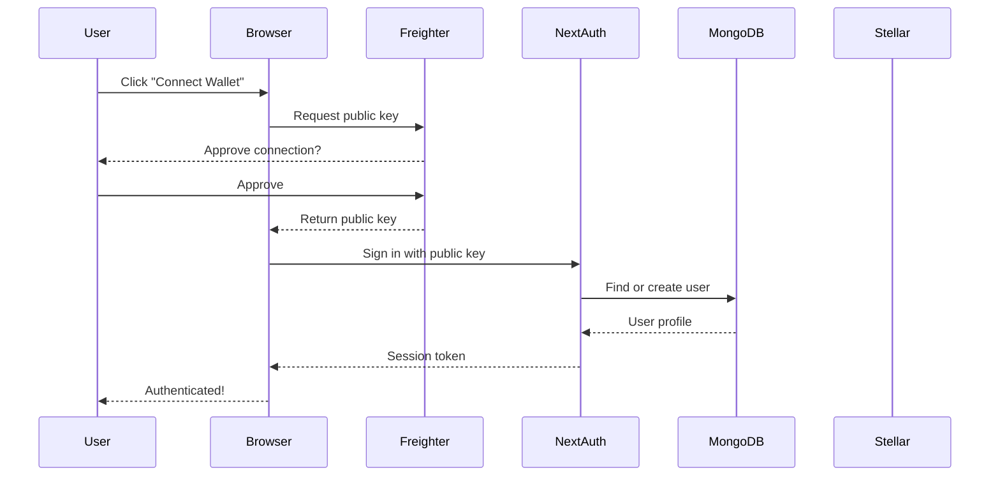

# Authentication

## Overview

blkfndr uses **Stellar Freighter wallet** for authentication. Users connect their Freighter browser extension, which provides their Stellar public key as their identity. Session management is handled by **NextAuth.js** with a **MongoDB** adapter for persistent sessions.

## Wallet Selection: Freighter

Freighter was chosen as the primary wallet for blkfndr because:

- **Purpose-built for Stellar dApps** — First-class support for Soroban smart contract interactions
- **Seamless transaction signing** — Native `signTransaction` and `signAuthEntry` methods
- **Widely adopted** — Most popular Stellar wallet with active development
- **Open-source & audited** — Transparent security posture
- **Available on all major browsers** — Chrome, Firefox, Brave, Edge

### Alternative Wallets

| Wallet | Best For | Use Case |
|---|---|---|
| **LOBSTR** | Beginners | Simple interface, built-in DEX access |
| **Ledger** | Large amounts | Hardware wallet, maximum security |
| **xBull** | Power users | Advanced features, multi-account management |
| **Solar Wallet** | Power users | Comprehensive asset management |

---

## Authentication Flow



### Step-by-Step

1. **User clicks "Connect Wallet"** on the login page
2. **Freighter extension prompts** the user to approve the connection
3. **Public key is returned** to the application
4. **NextAuth creates/retrieves** the user profile from MongoDB
5. **Session is established** with a JWT token stored in an HTTP-only cookie
6. **User is redirected** to the home page with full access

---

## Setup

### 1. Install Freighter

Download and install the Freighter browser extension from [freighter.app](https://freighter.app).

### 2. Configure Testnet

1. Open Freighter extension
2. Go to **Settings** → **Network**
3. Select **Testnet**
4. Fund your testnet account via [Friendbot](https://laboratory.stellar.org/#account-creator?network=test)

### 3. Environment Variables

```bash
# NextAuth Configuration
NEXTAUTH_SECRET=your_random_secret_key
NEXTAUTH_URL=http://localhost:9002

# MongoDB (for user profiles & sessions)
MONGODB_URI=mongodb://localhost:27017/blkfndr
```

---

## Code Implementation

### Auth Context

**File**: `src/context/AuthContext.tsx`

The `AuthContext` provides authentication state to all components:

```typescript
import { useSession, signIn, signOut } from 'next-auth/react';

function AuthProvider({ children }) {
  const { data: session, status } = useSession();

  const login = async () => {
    // Request Freighter public key
    const publicKey = await window.freighter.getPublicKey();

    // Sign in with NextAuth
    await signIn('credentials', {
      publicKey,
      redirect: false,
    });
  };

  const logout = async () => {
    await signOut();
  };

  return (
    <AuthContext.Provider value={{
      user: session?.user,
      isAuthenticated: status === 'authenticated',
      isLoading: status === 'loading',
      login,
      logout,
    }}>
      {children}
    </AuthContext.Provider>
  );
}
```

### Legacy Support: zkLogin (Deprecated)

The codebase contains legacy zkLogin integration for Google-based authentication on derived wallet addresses. This is marked for deprecation in favor of Freighter-based wallet connection. New projects should use Freighter exclusively.

### NextAuth Configuration

**File**: `src/lib/authOptions.ts`

```typescript
import { NextAuthOptions } from 'next-auth';
import CredentialsProvider from 'next-auth/providers/credentials';
import { MongoDBAdapter } from '@auth/mongodb-adapter';

export const authOptions: NextAuthOptions = {
  adapter: MongoDBAdapter(clientPromise),
  providers: [
    CredentialsProvider({
      name: 'Freighter',
      credentials: {
        publicKey: { label: 'Public Key', type: 'text' },
      },
      async authorize(credentials) {
        if (!credentials?.publicKey) return null;

        // Find or create user in MongoDB
        const user = await findOrCreateUser(credentials.publicKey);

        return {
          id: user.uid,
          name: user.name,
          email: user.email,
          image: user.avatarUrl,
          publicKey: credentials.publicKey,
        };
      },
    }),
  ],
  session: {
    strategy: 'jwt',
  },
  callbacks: {
    async jwt({ token, user }) {
      if (user) {
        token.publicKey = user.publicKey;
      }
      return token;
    },
    async session({ session, token }) {
      session.user.publicKey = token.publicKey;
      return session;
    },
  },
};
```

### Transaction Signing

All blockchain transactions are signed by Freighter:

```typescript
// Build Soroban transaction
const tx = new TransactionBuilder(account, {
  fee: '10000',
  networkPassphrase: Networks.TESTNET,
})
  .addOperation(contract.call('fund_project', ...args))
  .setTimeout(30)
  .build();

// Simulate
const simResult = await rpc.simulateTransaction(tx);
const preparedTx = SorobanRpc.assembleTransaction(tx, simResult);

// Sign with Freighter
const signedTxXDR = await window.freighter.signTransaction(
  preparedTx.toXDR(),
  { network: 'TESTNET' }
);

// Submit
const signedTx = TransactionBuilder.fromXDR(signedTxXDR, Networks.TESTNET);
const result = await rpc.sendTransaction(signedTx);
```

---

## User Data Model

**MongoDB Collection**: `users`

```typescript
interface User {
  uid: string;              // Unique user ID
  name: string;             // Display name
  email: string;            // Email address
  avatarUrl: string;        // Profile avatar URL
  role: 'user' | 'admin';   // User role
  stellarAddress: string;   // Stellar public key (primary identity)
  wallet: 'connected' | 'disconnected';
  createdAt: Date;
  updatedAt: Date;
}
```

---

## Session Management

### Session Structure

```typescript
interface Session {
  user: {
    id: string;
    name: string;
    email: string;
    image: string;
    publicKey: string;    // Stellar public key
    role: 'user' | 'admin';
  };
  expires: string;        // Session expiry timestamp
}
```

### Session Lifecycle

- **Creation**: On successful wallet connection
- **Duration**: Configurable via `NEXTAUTH_SECRET` (default: 30 days)
- **Refresh**: Automatic on each request
- **Expiry**: User must reconnect wallet after session expires

---

## Protected Routes

Routes that require authentication use middleware or client-side checks:

```typescript
// Client-side protection
import { useAuth } from '@/context/AuthContext';

function ProtectedPage() {
  const { isAuthenticated, isLoading } = useAuth();
  const router = useRouter();

  useEffect(() => {
    if (!isLoading && !isAuthenticated) {
      router.push('/login');
    }
  }, [isAuthenticated, isLoading]);

  if (isLoading) return <Loading />;
  if (!isAuthenticated) return null;

  return <div>Protected content</div>;
}
```

### Admin Routes

Admin-only routes additionally check the user's role:

```typescript
function AdminPage() {
  const { user, isAuthenticated } = useAuth();

  if (!isAuthenticated || user?.role !== 'admin') {
    return <AccessDenied />;
  }

  return <AdminDashboard />;
}
```

---

## Security Considerations

### Client-Side
- **No private keys stored** — Freighter keeps keys in the extension's secure storage
- **Session tokens** are HTTP-only cookies, inaccessible to JavaScript
- **CSRF protection** via NextAuth built-in CSRF tokens

### Server-Side
- **JWT sessions** are signed with `NEXTAUTH_SECRET`
- **MongoDB adapter** stores sessions server-side for revocation capability
- **Role-based access control** enforced on all admin endpoints

### Transaction Security
- **All transactions simulated** before signing to catch errors
- **User must approve** each transaction in Freighter UI
- **Transaction timeouts** prevent stale transactions from executing
- **Network validation** ensures transactions are on the correct network (testnet/mainnet)

---

## Troubleshooting

### Freighter Not Detected

```typescript
if (!window.freighter) {
  alert('Please install Freighter browser extension');
  window.open('https://freighter.app', '_blank');
}
```

### Wrong Network

```typescript
const network = await window.freighter.getNetwork();
if (network !== 'TESTNET') {
  alert('Please switch Freighter to Testnet');
}
```

### Session Expired

```typescript
const { data: session, status } = useSession();

if (status === 'unauthenticated') {
  // Prompt user to reconnect wallet
  router.push('/login');
}
```

### Common Issues

| Issue | Solution |
|---|---|
| Freighter not connecting | Ensure extension is installed and unlocked |
| Wrong network | Switch Freighter to Testnet in settings |
| No testnet XLM | Fund via [Friendbot](https://laboratory.stellar.org/#account-creator?network=test) |
| Session keeps expiring | Check `NEXTAUTH_SECRET` is set and consistent |
| Transaction rejected | User declined in Freighter — prompt to retry |