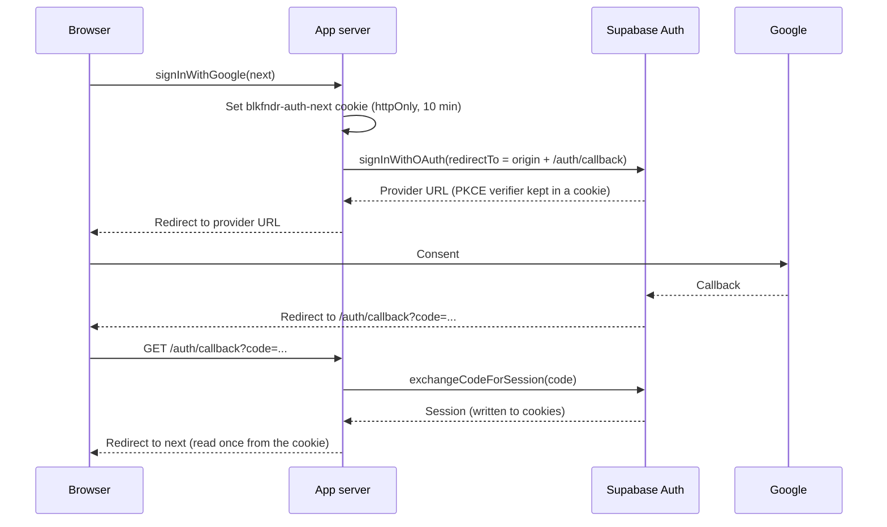
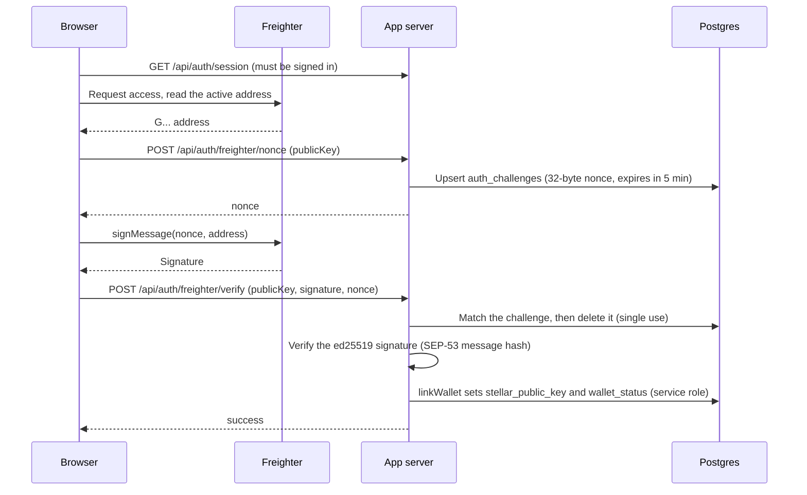

# Authentication

blkfndr keeps three questions apart, and answers each from a different place:

| Question | Answered by | Source of truth |
|---|---|---|
| Who are you? | Supabase Auth (email and password, or Google) | The Supabase session cookie, verified on the server |
| May you use the admin console, and for what? | The `platform_admins` roster | Postgres, read fresh on every request through `my_role()` |
| Which Stellar account is yours? | A Freighter signature challenge | `profiles.stellar_public_key`, written only after the signature checks out |

Signing in never touches a wallet, and linking a wallet never signs anyone in. Stakeholders, builders and owners sign every on-chain action in their own Freighter wallet. The platform holds no key over stakeholder funds or votes. The only keys it holds are the KYC attestors' signing keys, which can write identity attestations and nothing else (see [Managed attestor keys](#managed-attestor-keys)).

---

## Signing in

The browser has no Supabase client. Sign-in, sign-out and session checks all run on the server, through [src/app/auth/actions.ts](../src/app/auth/actions.ts) (server actions) and the route handlers under `src/app/auth` and `src/app/api/auth`. The session lives in cookies set by `@supabase/ssr`.

The sign-in dialog ([LoginDialog](../src/components/auth/LoginDialog.tsx) and [AuthForm](../src/components/auth/AuthForm.tsx)) offers Google, email sign-in and email sign-up. It passes the current page as `next`, so a successful sign-in returns the person to where they were.

### Email and password

| Action | Validation | On success | On failure |
|---|---|---|---|
| `signUpWithPassword` | Name 1–80 chars, valid email, password 12–72 chars | Supabase sends a confirmation email whose link returns to `/auth/confirm`. The browser goes to `/login?checkEmail=1`. | One generic message, so the form cannot reveal which addresses have accounts |
| `signInWithPassword` | Valid email and password | `redirect(next)`. `next` is re-checked by `safeInternalPath` and defaults to `/profile`. | "That email address and password do not match an account." The same message for a wrong password and an unknown address. |

The name is passed as `full_name` in user metadata. The `handle_new_user` trigger copies it into `profiles.display_name`. It is display data only. Nothing authorizes from it.

A new email account has no session until the address is confirmed. The confirmation link lands on [/auth/confirm](../src/app/auth/confirm/route.ts), which:

- accepts only the `token_hash` form (`?token_hash=…&type=…`) and verifies it with `verifyOtp`;
- sends a `recovery` link to `/settings` and everything else to `/profile`;
- sends a missing token to `/login?error=InvalidLink`, and a failed verification to `/login?error=LinkExpired`.

### Google (OAuth with PKCE)

`signInWithGoogle` stores the destination in a short-lived cookie and starts the Supabase OAuth flow. Supabase runs PKCE, so the code that comes back can only be redeemed by the browser that holds the matching verifier.

```mermaid
sequenceDiagram
    participant B as Browser
    participant A as App server
    participant S as Supabase Auth
    participant G as Google

    B->>A: signInWithGoogle(next)
    A->>A: Set blkfndr-auth-next cookie (httpOnly, 10 min)
    A->>S: signInWithOAuth(redirectTo = origin + /auth/callback)
    S-->>A: Provider URL (PKCE verifier kept in a cookie)
    A-->>B: Redirect to provider URL
    B->>G: Consent
    G-->>S: Callback
    S-->>B: Redirect to /auth/callback?code=...
    B->>A: GET /auth/callback?code=...
    A->>S: exchangeCodeForSession(code)
    S-->>A: Session (written to cookies)
    A-->>B: Redirect to next (read once from the cookie)
```

The destination travels in the `blkfndr-auth-next` cookie rather than as `?next=` on the redirect URL. Supabase matches its Redirect URL allow-list as a glob against the whole URL. A query string would force a wildcard entry, and a URL that matches nothing is not rejected: Supabase silently sends the user to the Site URL instead. Keeping `next` off the URL lets the allow-list hold exact paths. See [src/lib/auth/next-cookie.ts](../src/lib/auth/next-cookie.ts).

[/auth/callback](../src/app/auth/callback/route.ts) redirects failures to `/login` with a reason code:

| Situation | Redirect |
|---|---|
| Google or Supabase reported an error | `/login?error=Provider` |
| No `code` parameter | `/login?error=NoCode` |
| `exchangeCodeForSession` failed | `/login?error=Exchange` |
| Success | `next` from the cookie (or a re-validated `?next=`), default `/profile` |

### Where the browser lands: `/login`

Nobody stays on [/login](../src/app/login/page.tsx). It reads why the browser arrived, acts, and moves on to `/`:

| Arrival | Behaviour |
|---|---|
| `?checkEmail=1` | "Check your email" toast for 15 seconds. A fresh sign-up has no session yet, and that is not a failure. |
| `?error=<code>` | "Login failed" toast with the reason for that code (`Provider`, `NoCode`, `Exchange`, `InvalidLink`, `LinkExpired`), or a generic reason for an unknown code |
| Signed in | Goes to `/profile` |
| Plain visit, signed out | Opens the sign-in dialog |
| Session still loading after 10 seconds | "Login timed out" toast |

### Redirect targets

`safeInternalPath` ([src/lib/auth/safe-redirect.ts](../src/lib/auth/safe-redirect.ts)) is applied to every `next`, whether it comes from a form, a cookie or a query string. It accepts only a rooted path. It rejects protocol-relative paths (`//host`, `/\host`), control characters and anything that looks like a scheme, and falls back to `/profile`.

### The public origin

Redirect URLs are built from configuration, never from `request.nextUrl.origin`. Behind the reverse proxy that resolves to the container's own address (`https://0.0.0.0:3000`), and the browser would be sent somewhere it cannot reach.

[`publicOrigin()`](../src/lib/auth/app-origin.ts) works like this:

1. The allowed origins are `NEXT_PUBLIC_APP_URL` (canonical) plus any comma-separated entries in `APP_URLS`. Each is parsed, and an unparseable entry is dropped.
2. The request's `x-forwarded-host` and `host` headers only *select* among those origins. Both headers are attacker-controlled, so a value that matches nothing gets the canonical origin, never itself. This cannot become an open redirect.
3. With nothing configured, the origin is derived from the request host (`http` for localhost, `https` otherwise). In production this logs a warning.

**The origin must be `https://`.** Supabase compares the whole redirect URL, scheme included, against its allow-list. An `http://` origin on an https site does not raise an error. Supabase returns the user to the Site URL with a code nothing exchanges, so Google sign-in appears to work and then leaves the person signed out. This caused the 2026-09-28 sign-in outage. In production the app now logs `[auth] Public origin configured over plain http` once when it sees such an origin. `NEXT_PUBLIC_APP_URL` is a Docker build argument, so changing it needs a rebuild, not just a restart. See [deployment.md](deployment.md#3-url-configuration) for the URL configuration, and [its troubleshooting entry](deployment.md#google-sign-in-succeeds-but-the-user-comes-back-signed-out) for the log signature.

### Session refresh

[src/proxy.ts](../src/proxy.ts) (Next 16's renamed middleware) runs on every request except static assets. It calls `supabase.auth.getUser()`, which refreshes an expired access token and writes the new cookies. That keeps an expired token from looking like a sign-out.

It is **not** a security boundary. It can be bypassed, and it skips itself entirely when the Supabase environment variables are missing. Every page, route handler and server action checks the caller again itself.

### Signing out

The header's sign-out (`logout` in [AuthContext](../src/context/AuthContext.tsx)) does three things in order:

1. Unlinks the wallet from the account (`POST /api/auth/freighter/disconnect`). A failed unlink is logged and does not block sign-out. The wallet then stays linked until the next sign-in.
2. Ends the Supabase session (`POST /api/auth/logout`, which calls `supabase.auth.signOut()`).
3. Reloads the page at `/`.

Because sign-out unlinks the wallet, a returning user links their wallet again before any action that needs a linked wallet (KYC, milestone proof).

The admin page's "Sign in with a different account" button uses the `signOut` server action instead. That ends the session and redirects to `/`, but does not unlink the wallet.

---

## The client's view: `AuthContext`

[src/context/AuthContext.tsx](../src/context/AuthContext.tsx) builds `user` from one request: `GET /api/auth/session` ([route](../src/app/api/auth/session/route.ts)). Signed out, or on any error, the route returns `{}`. Signed in, it returns:

| Field | Source |
|---|---|
| `uid`, `email` | The verified session (`requireCaller`) |
| `name`, `creatorAvatar` | `profiles.display_name`, `profiles.avatar_url` |
| `role` | `"admin"` when the caller is on the `platform_admins` roster (any role), otherwise `"user"` |
| `wallet` | `profiles.wallet_status` |
| `stellarPublicKey` | `profiles.stellar_public_key`, the linked wallet |

The session response carries no provider token.

The context sets `role` to `"admin"` only when the session says exactly that. The dialog's `login(role)` argument grants nothing. `role` is a display hint for badges. The server never trusts it.

`stellarPublicKey` is kept only if it is a well-formed `G…` key. `wallet` is `"connected"` only when such a key is linked and `wallet_status` agrees.

### The linked wallet and the wallet in use

Two addresses exist on the client, and they can differ:

- **`user.stellarPublicKey`** is the account's linked wallet, which it proved by signing a challenge. Server checks use this one.
- **`freighterWalletAddress`** (from [FreighterWalletProvider](../src/context/FreighterWalletProvider.tsx)) is the address transactions are built for and signed as. On load it is the linked wallet, or Freighter's active account when none is linked and the person has not disconnected. After that it changes only when the person connects, links or disconnects.

Nothing pushes the linked key back into `freighterWalletAddress`. An earlier effect did, and it reverted every wallet the person had just connected (#89).

---

## Coming back to where you were after sign-in

Both sign-in paths rebuild the client tree. Google returns through a full page navigation. A password sign-in ends in a server-action `redirect()`, which Next's redirect boundary handles by remounting the whole client tree. Any open dialog is gone either way, and `LoginDialog`'s `onLoginSuccess` callback never runs.

So a signed-out press inside a project dialog (fund, connect wallet, proof, finalize, refund) calls `signInToContinue({ fund })` in [ProjectDetailsContext](../src/context/ProjectDetailsContext.tsx) instead of `login()` directly:

1. It writes `{ id, fund, at }` to `sessionStorage` under `blkfndr.resume-project`. That storage is per tab and survives both round trips.
2. It opens the sign-in dialog.
3. Once a signed-in user resolves, the provider reads the note, fetches the project and reopens it, in the fund flow if that was the intent.

Nothing is consumed while signed out. The note expires after 10 minutes, the same lifetime as the destination cookie. Closing the project dialog clears it. If storage is unavailable, sign-in still works, and the project just does not reopen by itself.

---

## Server-side authorization

### Every server action is a public endpoint

Every exported async function in a `"use server"` file can be called over HTTP by its action id, whether or not any component calls it. The same is true of every route handler. So each one:

- treats its arguments as hostile and validates them (usually with zod), and
- calls a guard before it reads or writes anything user-scoped.

The `"use server"` files are [src/app/actions.ts](../src/app/actions.ts), [src/app/auth/actions.ts](../src/app/auth/actions.ts), [src/app/settings/actions.ts](../src/app/settings/actions.ts) and everything in [src/actions/](../src/actions/). Many of them are thin wrappers. The guard runs in the data layer under `src/lib/data/`, next to the query it protects.

RLS is the second layer. Queries made through the caller's own client ([src/lib/supabase/server.ts](../src/lib/supabase/server.ts)) are confined by row-level security, so a forgotten guard does not decide whose data comes back. Queries made through the service-role client ([src/lib/supabase/admin.ts](../src/lib/supabase/admin.ts)) bypass RLS. For those, the guard in code is the only boundary.

### Guards

Defined in [src/lib/supabase/auth.ts](../src/lib/supabase/auth.ts) and re-exported, with two helpers, from [src/lib/auth/guards.ts](../src/lib/auth/guards.ts):

| Guard | Passes when | Fails with |
|---|---|---|
| `requireCaller()` | A valid session exists. Identity comes from `getClaims()`, which verifies the token. `getSession()` is never used to authorize, since its contents can be forged. | `AuthError` 401 |
| `getCaller()` | Same, but returns `null` instead of throwing. For pages that render differently when signed out. | — |
| `requireAdmin()` | The caller is on the roster, in any role | `AuthError` 403 |
| `requireKycReviewer()` | Roster role is `owner`, `platform_admin` or `kyc_manager` | `AuthError` 403 |
| `requireWalletOwnerOrAdmin(address)` | The caller's linked wallet equals `address`, or the caller is an admin | 401 or 403 |
| `authFailure(error)` | Helper: maps an `AuthError` to `{ success: false, error }` and returns `null` for anything else, so real bugs still surface | — |

`requireCaller()` returns `{ userId, email, isAdmin, role }`. It asks the database for the role on every call (`supabase.rpc("my_role")`), so removing someone from the roster takes effect on their next request, not when their token is reissued.

The platform administrator's tools in [src/lib/data/moderation.ts](../src/lib/data/moderation.ts) add their own check, `has_admin_role('platform_admin')`.

### Roles: the `platform_admins` roster

[platform_admins](../supabase/migrations/20260807112735_platform_admins.sql) lists who may use the admin console. An entry is keyed by email, so someone can be invited before they have an account. The `claim_admin_invite` trigger fills in `user_id` when that address first signs up, and `grantAdmin` binds an existing account immediately.

Each row has one `admin_role`. The console offers four groups ([src/lib/admin-roles.ts](../src/lib/admin-roles.ts), `ASSIGNABLE_ROLES`). A fifth value, `accountant`, remains in the enum for the type and any historic rows:

| `admin_role` | Shown as | What it gates | Signing key |
|---|---|---|---|
| `owner` | Owner | Holds a share and votes. The only role that may edit the roster (`is_owner()`), vote on project approvals and decide feature requests. `has_admin_role(x)` is true for an owner for every `x`. | Their own wallet, in Freighter |
| `platform_admin` | Platform Administrator | Bans and platform health (`platform_bans` RLS), hiding and locking projects, KYC review (in code) | Their own wallet, in Freighter |
| `kyc_manager` | KYC Attestor | KYC review and on-chain attestation (`kyc_requests` RLS) | Platform-managed attestor key. They never connect a wallet. |
| `project_approver` | Project Administrator | Project moderation (`project_moderation` RLS), hiding and locking projects | Their own wallet, in Freighter |
| `accountant` | Accountant | Read-only. No write policy names it. Not offered when adding someone. | — |

The database functions are all `SECURITY DEFINER`, take no caller-supplied identity, and answer only about `auth.uid()` (or the token's email, for an unclaimed invite):

| Function | Returns |
|---|---|
| `is_admin()` | Whether the caller is on the roster at all |
| `is_owner()` | Whether the caller is an owner |
| `has_admin_role(wanted)` | Whether the caller holds `wanted` or is an owner |
| `my_role()` | The caller's role, or `null` when they are not on the roster ([migration](../supabase/migrations/20260809140000_my_role.sql)) |
| `can_restrict_projects()` | `has_admin_role('project_approver') or has_admin_role('platform_admin')` |

Nobody can remove themselves from the roster, and the last entry cannot be removed (`guard_admin_removal`).

`/admin` ([page](../src/app/admin/page.tsx)) renders the dashboard only for a roster member. That check saves sending a UI to someone who cannot use it. The real gates are the guards and RLS on every request the dashboard makes.

### Two rosters, two powers

| Roster | Decides | Enforced by |
|---|---|---|
| `platform_admins` (Postgres) | Who may use the console | RLS and the guards above |
| `blkfndr-admin` (on-chain) | Who may sign an admin-level contract change | The ledger, which checks the signature and does not consult Postgres |

Holding one does not grant the other. Neither one can release a milestone, block a refund or move a vault's balance. Those follow the stakeholders' votes in the vault contract.

### `app_metadata` and `user_metadata`

- **`user_metadata`** is self-service, and the user can set it to anything. Only display data comes from it: `full_name` and `avatar_url`, copied into `profiles` at sign-up.
- **`app_metadata`** can be written only with the service-role key. When a wallet is linked, `syncAdminClaim` ([src/lib/data/profiles.ts](../src/lib/data/profiles.ts)) still writes `app_metadata.role` = `"admin"` or `"user"` from the on-chain `blkfndr-admin` roster, and unlinking resets it to `"user"`. Nothing authorizes from that value any more. Admin status comes from the roster, read fresh, because a role cached in a token only ever goes stale in the dangerous direction.

### Bans

A platform administrator's ban ([src/lib/data/moderation.ts](../src/lib/data/moderation.ts), [migration](../supabase/migrations/20260809020618_platform_bans.sql)) has two halves:

1. **Content.** A row in `platform_bans`. The public listing policy on `projects` hides any project whose `creator_address` is the linked wallet of a banned user (`creator_is_banned`).
2. **Sign-in.** A Supabase Auth ban on the account (`ban_duration: 876000h`, through the service-role client), so the person cannot sign in or refresh their session. This half is best-effort. If it fails, the content ban still stands.

The app's guards do not consult `platform_bans`. Keeping a banned user out is the Supabase Auth ban's job.

### Machine callers

The cron routes take no session. `/api/indexer` (GET and POST), and `POST` on `/api/keep-alive`, `/api/ops-funding` and `/api/settle-stalled`, require `Authorization: Bearer <INDEXER_SECRET>` and refuse every request when the secret is unset.

---

## Linking a wallet (Freighter)

Linking proves that the signed-in account controls a Stellar address. The flow is `login()` in [FreighterWalletProvider](../src/context/FreighterWalletProvider.tsx), behind the header's Connect button, wallet settings and the KYC page:

```mermaid
sequenceDiagram
    participant B as Browser
    participant F as Freighter
    participant A as App server
    participant D as Postgres

    B->>A: GET /api/auth/session (must be signed in)
    B->>F: Request access, read the active address
    F-->>B: G... address
    B->>A: POST /api/auth/freighter/nonce (publicKey)
    A->>D: Upsert auth_challenges (32-byte nonce, expires in 5 min)
    A-->>B: nonce
    B->>F: signMessage(nonce, address)
    F-->>B: Signature
    B->>A: POST /api/auth/freighter/verify (publicKey, signature, nonce)
    A->>D: Match the challenge, then delete it (single use)
    A->>A: Verify the ed25519 signature (SEP-53 message hash)
    A->>D: linkWallet sets stellar_public_key and wallet_status (service role)
    A-->>B: success
```

Details that matter:

- **The signature** is checked against SHA-256 of `"Stellar Signed Message:\n" + nonce`, the message format Freighter's `signMessage` signs.
- **Both routes call `requireCaller()`.** A wallet is attached to an account, so there must be one. ([nonce](../src/app/api/auth/freighter/nonce/route.ts), [verify](../src/app/api/auth/freighter/verify/route.ts))
- **Challenges** live in `auth_challenges`, one per public key, written and read only with the service-role client. Browser roles have no grant on the table. Expiry is enforced in the query, and expired rows are purged opportunistically ([src/lib/data/platform.ts](../src/lib/data/platform.ts)).
- **The challenge is burned before the signature is checked**, so a failed verification cannot be retried against the same nonce.
- **`linkWallet`** writes the caller's own row with the service-role client, scoped in code to `caller.userId`. `stellar_public_key` is unique, so a wallet already linked to another account fails with 403 "That wallet is already linked to another account."
- **Unlinking** (`POST /api/auth/freighter/disconnect` → `unlinkWallet`) clears `stellar_public_key`, sets `wallet_status` to `disconnected`, and resets `app_metadata.role`. The client unlinks first and forgets the wallet locally only once the server confirms (#89). A failed unlink changes nothing and says why: the session ended (401), or the server could not unlink (500).

After a link or unlink, the UI calls `refreshUser()` so `AuthContext` picks up the new linked wallet.

### Column grants: the write-only defense

`linkWallet` writes through the service-role client because [20261007100549_profiles_column_grants.sql](../supabase/migrations/20261007100549_profiles_column_grants.sql) revokes the table-wide `UPDATE` on `profiles` from `authenticated` and grants back only `display_name` and `avatar_url`. With it applied, the signature challenge is the only way to set `stellar_public_key`.

**Applied on the live database on 2026-10-07.** Before it, a signed-in user could set their own `stellar_public_key` directly through PostgREST, without a signature, to any address no other account had linked; a live dry run confirmed it, and confirmed it refused afterwards. It also revokes `anon`'s table-wide `UPDATE`. Every check that trusts the linked wallet (`requireWalletOwnerOrAdmin`, the KYC filing rule, the notifications and "Needs you" keyed on it) rests on this column.

---

## Signing transactions

Every Freighter-signed contract call goes through one signer, `freighterSigner(publicKey)` in [src/lib/freighter-signer.ts](../src/lib/freighter-signer.ts). It is used by the listing form (vault launch), the project dialog, [use-stellar-contract.ts](../src/hooks/use-stellar-contract.ts) (contributions, votes, releases, refunds, attestor and fee-wallet changes) and [treasury-signing.ts](../src/lib/treasury-signing.ts) (treasury, platform vault and Operations Vault panels).

What it guarantees:

- **It carries `publicKey`.** The contract clients take their source account from the signer, so the transaction is built from the account that will sign it. Without it they simulated from the SDK's placeholder account and failed before Freighter was asked (#93).
- **Each request names its account.** `signTransaction` and `signAuthEntry` pass `address: publicKey` and the app's network passphrase (testnet).
- **Freighter's reply is checked before the SDK sees it** (#84). The SDK only throws for error codes −1 to −4 and crashes on a missing signature (`reading 'switch'`). The signer turns every case into a readable error.
- **The signer must be the requested account** (#89). When Freighter does not hold the requested account, it signs with whichever account is selected and reports that as `signerAddress`. The SDK ignores that field, so the transaction used to fail on the network after the person had approved it. Now a mismatch is refused before anything is sent.

| Freighter's reply | Message the person sees |
|---|---|
| Code −4 | You declined the request in Freighter. Nothing has been sent to the network. |
| Code −3 | Freighter rejected the request as malformed: … |
| Code −2 | Freighter could not reach a service it needs: … |
| Code −1 | Freighter hit an internal error: … |
| Any other code | Freighter's own message |
| No signature at all | Freighter didn't return a signature — the request was cancelled or expired… If a Freighter window is still open, close it… Nothing has been sent to the network. |
| Signed by another account | Freighter signed with G…, but this transaction is for G…. If that account is in Freighter, select it there and try again… Nothing has been sent to the network. |

A decline (−4) and a missing signature throw `FreighterDeclined`, so callers can show "Signing cancelled" rather than a failure.

The server-side signers in [src/lib/managed-wallet.ts](../src/lib/managed-wallet.ts) do not use Freighter. They sign only KYC attestations and revocations, and moving gas to and from the attestor wallets.

---

## Identity (KYC)

An approved identity check clears one Stellar address on the identity registry. A vault's constructor refuses a builder address the registry has not cleared (`is_kyc_approved`). So a check must be filed against an address the applicant has proven they control.

### Filing

1. **The wallet is linked first.** The [verification page](../src/app/profile/kyc-attestation/page.tsx) asks for the link before showing the form.
2. **The document is uploaded** to `POST /api/kyc-document` ([route](../src/app/api/kyc-document/route.ts)). It requires a session, accepts up to 10 MB, and identifies the file from its leading bytes (PNG, JPEG, WebP or PDF), not from the client's Content-Type. The file goes to the private `kyc-documents` Storage bucket under `<user_id>/…`, a prefix taken from the session, never from the request. Only the path comes back. Identity documents never go to IPFS: a content address is permanent, and an applicant may ask for their document to be erased.
3. **The submission** (`submitKycRequest` → `submitOwnKyc` in [src/lib/data/kyc.ts](../src/lib/data/kyc.ts)) is validated with zod and refused unless `stellarAddress` equals the caller's linked wallet. It is written through the caller's own client, so RLS pins `user_id` to the caller and `status` to `pending`. An approved check cannot be resubmitted, and a resubmission cannot move the check to another address.

The same rule is in the database. [20261006155050_kyc_wallet_optional_at_submit.sql](../supabase/migrations/20261006155050_kyc_wallet_optional_at_submit.sql) requires both `kyc_requests` write policies' `stellar_address` to be null (a check filed before the applicant has a wallet, attached later by the server) or the caller's linked wallet, so an insert straight through PostgREST cannot skip the server check. It replaced 20261001160000, which is kept as a no-op so a `db push` cannot reapply its stricter policies.

### Review

- Identity columns on `kyc_requests` are granted to no browser role. Reviewers read them through the service-role client, one record at a time, in `getSubmissionForReview`, behind `requireKycReviewer()`.
- The document is served as a signed URL that expires after 5 minutes. The bucket has no read policy for any browser role.
- **Approve** (`attestKycAction`): the server signs the attestation on the identity registry with the reviewer's managed key, then records the decision. The chain write comes first, so a failed attestation never leaves a check marked approved.
- **Reject** (`updateKycRequestStatus`): records the decision with the reviewer's reason (up to 500 characters).
- **Revoke** (`revokeSubmissionAttestation`): signs a revocation with the managed key, then marks the check rejected.

Every decision notifies the applicant (#79). `decideSubmission` calls `notify()`, which adds a bell notification linking to `/profile/kyc-attestation`. A rejection includes the reviewer's reason. `NotificationBell` shows a toast for newly arrived unread notifications. A failed notification cannot undo a recorded decision.

### Managed attestor keys

A KYC Attestor reviews documents. They are not expected to run a Stellar wallet. When an owner adds someone with the `kyc_manager` role, `grantAdmin` has the platform:

- generate a keypair, store the secret in Supabase Vault (`set_managed_key`, callable by the service role only), and record the public key in `platform_admins.managed_wallet`;
- fund it with friendbot on testnet. On mainnet it stays empty until the Operations Vault funds it with gas.

The key can `attest` and `revoke` on the identity registry, and nothing else. It is not the registry admin. Appointing it as an attestor is a separate step that an owner signs from their own wallet. It holds no project funds. When the attestor is removed, the remaining gas is swept back to the Operations Vault and the key is deleted. See [src/lib/managed-wallet.ts](../src/lib/managed-wallet.ts) and [the migration](../supabase/migrations/20260809150000_managed_attestor_keys.sql).

These are the only keys the platform holds. Stakeholder, builder and owner keys stay in their own wallets.

---

## Configuration

| Variable | When it is read | Purpose |
|---|---|---|
| `NEXT_PUBLIC_SUPABASE_URL`, `NEXT_PUBLIC_SUPABASE_ANON_KEY` | Build (Docker build args) | Supabase project and its public key. The image build fails if either is empty. |
| `SUPABASE_SECRET_KEY` | Runtime | Service-role client. `createAdminClient()` refuses to run without it. |
| `NEXT_PUBLIC_APP_URL` | Build (Docker build arg) | Canonical public origin. Must be `https://` in production. Changing it needs a rebuild. |
| `APP_URLS` | Runtime | Extra public origins, comma-separated, for more than one domain |
| `INDEXER_SECRET` | Runtime | Bearer token for the cron routes |

In the Supabase dashboard (Authentication → URL Configuration), the Site URL is the https origin, and the Redirect URLs list `/auth/callback` and `/auth/confirm` on that origin as exact entries. The Google provider must be enabled. Because `/auth/confirm` accepts only `token_hash` links, the confirmation and recovery email templates must link to `/auth/confirm?token_hash={{ .TokenHash }}&type=…`. A template that uses `{{ .ConfirmationURL }}` goes through Supabase's own verify endpoint instead. See [deployment.md](deployment.md) for the full checklist and the first administrator.

---

## Known gaps

| Gap | State |
|---|---|
| **No "forgot password" UI.** `requestPasswordReset` exists in [src/app/auth/actions.ts](../src/app/auth/actions.ts) and is deliberately kept, but nothing calls it. `/settings`, where a recovery link lands, has no form for setting a new password. | Unwired, pending a wire-up-or-delete decision |
| **Admin menu link follows the chain.** The header shows the Admin link from the on-chain `blkfndr-admin` roster for the wallet in use (`useAdminStatus`), not from `platform_admins`. Console-only admins reach `/admin` directly. | Open |
