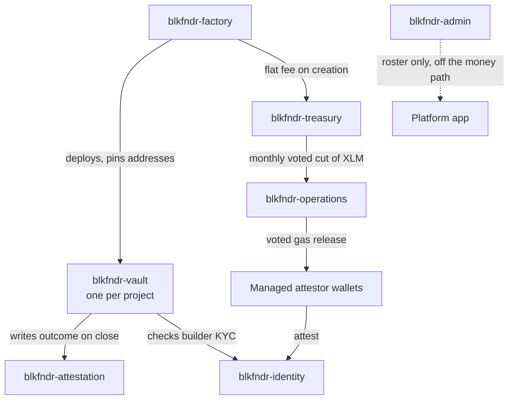

# Smart Contracts

blkfndr is a suite of seven Soroban contracts (Rust, compiled to WASM) on Stellar. The design has one governing idea: **no platform key sits anywhere in the path that moves money.** A project's funds live in a contract, not an account; releases happen on a vote by the people with a stake in the project; and the record of what happened is append-only. What the platform can do — set fees, review KYC, moderate listings — is deliberately kept out of the contracts that hold value.

Everything below is generated to TypeScript bindings under `src/packages/` and is reproducible from source with `bash scripts/build-contracts.sh`.

## The suite

| Contract | Responsibility | Holds value? |
|---|---|---|
| `blkfndr-vault` | Per-project vault: stakes, the builder's bond, stakeholder-weighted milestone voting, refunds, forfeiture | **Yes** — one instance per project |
| `blkfndr-factory` | Deploys vaults from one audited wasm hash and pins the platform addresses each vault trusts | No |
| `blkfndr-attestation` | Append-only builder completion record. No update and no delete entrypoint exists | No |
| `blkfndr-identity` | KYC attestation registry. Named attestors write approvals; the platform holds their signing keys | No |
| `blkfndr-admin` | Platform-administrator roster. **Not in the path that releases funds** | No |
| `blkfndr-treasury` | Platform fee treasury and owner-voted governance (fee, bond, shareholders, ops-funding cut) | **Yes** — pooled fees only |
| `blkfndr-operations` | Operations Vault: the governed gas budget for moderation. Holds no project funds | **Yes** — gas only |

### How they relate



A vault trusts only the addresses the factory pinned into it at creation, so a project cannot be pointed at a different fee wallet or identity registry after the fact. The factory's own admin can be handed to the treasury, which puts fee and policy changes behind an owner vote rather than one signature.

### Deployed to testnet

| Contract | Address |
|---|---|
| Factory | [`CDIXGE5M…F7BGKR7D5`](https://stellar.expert/explorer/testnet/contract/CDIXGE5MWFAYXA7FKLB4CDRSSQZ6VQSGHT6O6OY3TFTWVF6F7BGKR7D5) |
| Attestation registry | [`CDLL2A4R…JSNB2SO7`](https://stellar.expert/explorer/testnet/contract/CDLL2A4RBSQPKSPTEE3O4HNSDICSJEGCHAWIGUYVRPGOKVEPJSNB2SO7) |
| Identity registry | [`CCDBWBFE…RWZT27TGW`](https://stellar.expert/explorer/testnet/contract/CCDBWBFEK3YVXD2CDTJ4NFDPO7DB3OLB4YVX7BZI22M7QM4RWZT27TGW) |
| Admin roster | [`CAHAOAX5…AU6WAGOG`](https://stellar.expert/explorer/testnet/contract/CAHAOAX52JAQ75C3INJIDVKT7EITWDVPYP2K27NJTD4CPYZUAU6WAGOG) |
| Treasury | [`CCNID3UW…H3XGIGZS`](https://stellar.expert/explorer/testnet/contract/CCNID3UWTBEV67U7COG7LEWGTT63KYBM42M5XQ2OX6TWFLE3H3XGIGZS) |
| Operations Vault | [`CDZXCWKY…Z3PDHJQAP`](https://stellar.expert/explorer/testnet/contract/CDZXCWKY7J4CEF7MFXMOHB377OREDLM3LESNIZIQ4LIVIR6Z3PDHJQAP) |

The vault is **not** deployed as a contract of its own. Its wasm is uploaded once and the factory instantiates one instance per project from that hash, so any project's vault can be checked against it:

```
blkfndr_vault.wasm  sha256:9c20bca3e364d26240f83f03c11bd40ee30092fa2520bb1e767ba2c9a596db41
```

Amounts are in stroops throughout (1 unit = 10,000,000 stroops, 7 decimals). Deployed parameters: flat fee 10 units, minimum contribution 5 units, milestone voting window 7 days, minimum bond 5% of goal.

---

## blkfndr-vault

One vault per project. It holds every stake and the builder's performance bond in the same contract, runs the milestone votes that release money, and refunds automatically when a project misses its goal or a milestone fails. **81 tests.**

### Lifecycle states

`VaultState`: `Raising` → `Funded` → `Active` → `Completed`, with `Failed` and `Refunding` as the terminal money-returning branches.

### Key type

```rust
struct VaultInitConfig {
    project_id: u64, creator: Address, token: Address,
    goal: i128, deadline: u64, bond_amount: i128,
    identity_registry: Address, attestation_registry: Address,
    factory: Address, fee_wallet_address: Address,
    platform_fee: i128, voting_window_secs: u64,
    min_contribution: i128, milestones: Vec<MilestoneInput>,
    metadata_cid: String,
}
```

### Entrypoints

| Function | Who | Effect |
|---|---|---|
| `initialize(config)` | Factory only | Takes the bond + flat fee from the creator in the same transaction, pins the trusted addresses, opens the raise |
| `contribute(contributor, amount)` | Anyone (KYC-gated) | Adds a stake; `amount ≥ min_contribution`; records voting weight |
| `settle()` | Anyone | Closes the raise: `Funded` if the goal is met, `Failed` if the deadline passed short |
| `return_bond()` | Anyone | Returns the bond to the builder when a failed raise is settled |
| `open_milestone_vote(id)` | Creator | Opens a fixed-window vote on a milestone tranche |
| `approve_milestone(contributor, id)` | Stakeholder | Casts weighted approval for a milestone |
| `release_milestone(id)` | **Anyone** | Permissionless: executes a carried vote and pays the tranche |
| `settle_lapsed_milestone(id)` | Anyone | Fails a milestone whose window lapsed without carrying; forfeits the bond |
| `claim_refund(contributor)` | Stakeholder | Pro-rata claim of remaining funds (and forfeited bond) after failure |

Reads: `get_state`, `get_info`, `get_balance`, `get_contributors(offset, limit)`, `contributor_count`, `get_voting_weight`, `has_voted`, `get_milestone_vote`.

### Invariants

- **>50% of the total raise** must approve a release (`RELEASE_THRESHOLD_BPS = 5_000`).
- **No wallet counts for more than 20%** of the vote, however much it contributed (`WEIGHT_CAP_BPS = 2_000`). Clearing >50% in ≤20% steps always takes **at least three distinct wallets** — pinned by `a_majority_contributor_cannot_release_alone` and `release_requires_at_least_three_distinct_wallets`.
- **Silence returns money, never releases it.** A lapsed window fails the milestone and makes funds claimable; it can never pay the builder.
- Paged reads are capped (`MAX_PAGE = 100`) so no caller can request a page large enough to exceed the resource budget.

---

## blkfndr-factory

Deploys vaults and is the single place that decides what code a vault runs and which platform addresses it trusts.

| Function | Who | Effect |
|---|---|---|
| `initialize(...)` | Deployer, once | Sets admin, fee wallet, fee, bond %, identity + attestation registries, voting window, min contribution, vault wasm hash |
| `create_vault(config)` | Builder | Instantiates a vault from the pinned wasm hash and pins the trusted addresses into it |
| `update_wasm_hash / update_fee_wallet / update_platform_fee / update_bond_percentage / update_identity_registry / update_voting_window / update_min_contribution` | Admin | Policy for **future** vaults; existing vaults keep what they were created with |
| `transfer_admin(new_admin)` | Admin | Hands factory admin over — this is how admin is handed to the treasury for vote-gated governance |

Reads: `is_vault`, `get_vault(project_id)`, `get_admin`, `get_fee_wallet`, `get_platform_fee`, `get_bond_percentage`, `get_identity_registry`, `get_attestation_registry`, `get_voting_window`, `get_min_contribution`, `get_project_count`.

The app reads the treasury address from the factory's `get_fee_wallet` rather than from configuration, so repointing fees repoints the whole app.

---

## blkfndr-attestation

An append-only record of every project a builder has closed. There is **no update entrypoint and no delete entrypoint** — a bad outcome cannot be scrubbed before the next raise. Trusted factories may be added but **deliberately never removed**. `MAX_PAGE = 100`, `MAX_FACTORIES = 16`.

| Function | Who | Effect |
|---|---|---|
| `initialize(admin, factory)` | Deployer | Sets admin and the first trusted factory |
| `add_factory(factory)` | Admin | Trusts another factory's vaults to write; cannot be undone |
| `attest(...)` | A trusted factory's vault | Writes `builder, project, outcome, raise, bond, milestones_approved, timestamp` |
| `transfer_admin(new_admin)` | Admin | — |

Reads: `get_record(project_id)`, `has_record`, `get_builder_projects(builder)`, `get_builder_history(...)`, `get_builder_summary(builder) -> (succeeded, failed, total)`, `get_factories`, `is_factory_trusted`, `get_admin`. `Outcome` records how a project ended.

---

## blkfndr-identity

The KYC gate. Named attestors write approvals; the vault checks them before accepting a stake. The platform holds the attestors' signing keys as **managed, gas-only wallets** (see [Architecture](architecture.md)), so a human reviewer approves KYC in the console and the server signs `attest` — the reviewer never touches a wallet.

| Function | Who | Effect |
|---|---|---|
| `initialize(admin)` | Deployer | — |
| `add_attestor(account)` / `remove_attestor(account)` | Admin (owner Freighter) | Appoints / removes a KYC attestor. Kept owner-signed on purpose: the registry admin key also carries `set_admin` power |
| `attest(attestor, address, kyc_hash)` | Attestor | Records an approval (hash of the off-chain KYC record) |
| `revoke(attestor, address)` | Attestor | Withdraws an approval |
| `transfer_admin(new_admin)` | Admin | — |

Reads: `is_kyc_approved(address)`, `get_attestation(address)`, `is_attestor`, `get_admin`. An attestor's managed key can **only** call `attest`/`revoke` — it is contract-enforced to hold no other authority and never custodies funds.

---

## blkfndr-admin

The platform-administrator roster, and nothing more. It is **not** in the path that releases funds — it exists so the app can check "is this account a platform admin?" on-chain. `DataKey` is just `Owner` and `Admins`.

| Function | Who | Effect |
|---|---|---|
| `initialize(owner)` | Deployer | — |
| `add_admin(account)` / `remove_admin(account)` | Owner | Roster edits |
| `transfer_ownership(new_owner)` | Owner | — |

Reads: `is_admin(account)`, `get_admins`, `get_owner`, `admin_count`.

---

## blkfndr-treasury

Where the flat listing fees pool, and the governance seat for the whole platform. Owners hold equal shares by default and vote **two-thirds by headcount** (`APPROVAL 2/3`: two of three, three of four) to distribute the balance to shareholders and to set platform policy. **45 tests.**

Two independent flows share the contract:

- **Distribution cycles** — `open_cycle(opener, token)` → `approve_cycle(voter)` → `claim(shareholder, cycle_id)`, with `settle_lapsed_cycle` to expire a stalled vote. A carried cycle *reserves* its snapshot so a later cycle can never pay an earlier shareholder's owed share to someone else. Releases are rate-limited to one per **30 days** (`MIN_RELEASE_INTERVAL`).
- **Policy proposals** — `propose(proposer, action)` → `approve_proposal(voter)` → `execute_proposal()`.

`GovernedAction` — everything a vote can change:

| Variant | Changes |
|---|---|
| `SetFee(i128)` | The flat listing fee |
| `SetBondBps(u64)` | The performance bond, in basis points of the raise |
| `SetShareholders(Vec<Shareholder>)` | The shareholder register (deliberate unequal splits) |
| `SetOwners(Vec<Address>)` | The owners, splitting the treasury equally between them |
| `SetWasmHash(BytesN<32>)` | The wasm every **future** vault runs — the platform's upgrade lever |
| `SetFeeWallet(Address)` | Where fees go — including to a replacement treasury |
| `SetIdentityRegistry(Address)` | Which registry vouches for builder identity |
| `SetVotingWindow(u64)` | How long milestone votes stay open |
| `SetMinContribution(i128)` | The smallest stake a vault accepts |
| `TransferAdmin(Address)` | Hands factory admin back to a human — the reversible escape hatch |
| `SetOpsFunding(OpsFundingTerms)` | The monthly XLM cut routed to the Operations Vault |

Ops-funding, once voted, runs itself: `fund_operations()` is **permissionless and 30-day-gated**, moving `bps` of the **unreserved** XLM balance to the Operations Vault. It refuses while a distribution cycle is mid-vote, and it never touches money owed to a shareholder.

```rust
struct Shareholder { address: Address, share_bps: u32 }   // all shares total 10_000
struct OpsFundingTerms { vault: Address, token: Address, bps: u32 }
```

Reads: `get_shareholders`, `get_cycle`, `get_open_cycle`, `get_reserved`, `get_available`, `get_proposal`, `get_factory`, `has_claimed`, `balance_of`, `next_release_at`, `get_ops_funding`, `next_ops_funding_at`, `ops_funding_available`.

---

## blkfndr-operations

The Operations Vault: a governed pot of XLM that pays the gas for moderation (KYC attestation, project approval). It holds **no project funds** — only the platform's own gas budget. Owners are plain voters with no shares; they vote **two-thirds by headcount** and execution is **permissionless** (the carried vote is the authority — no owner key signs the transfer). **26 tests.**

| Function | Who | Effect |
|---|---|---|
| `initialize(deployer, owners)` | Deployer, once | Sets the owner set (bounded `MAX_OWNERS = 20`) |
| `propose(proposer, action)` | Owner | Opens a proposal |
| `approve(voter)` | Owner | Casts a vote |
| `execute()` | **Anyone** | Runs a carried proposal |

`GovernedAction`:

| Variant | Effect |
|---|---|
| `Release(ReleaseTerms)` | Pay one destination |
| `ReleaseMany(Vec<ReleaseTerms>)` | Pay the whole custodial-wallet roster in one carried vote — **all-or-nothing** (bounded `MAX_RELEASE_BATCH = 50`), so a batch never funds some wallets and strands others |
| `SetOwners(Vec<Address>)` | Replace the owner set |
| `SetVotingWindow(u64)` | Change how long a proposal stays open |

```rust
struct ReleaseTerms { token: Address, amount: i128, to: Address }
```

`ReleaseMany` is the monthly gas top-up to every active managed attestor wallet at once. Because a Soroban SAC `transfer` to a fresh classic address both creates and funds that account, one carried vote can provision a brand-new moderator's wallet directly from the vault.

Reads: `get_owners`, `is_owner`, `get_proposal`, `vote_window`, `balance_of`.

---

## Governance model, in one place

Both value-governing contracts (treasury, operations) share the same spine, chosen for a reason:

- **Two-thirds by headcount, not by share.** Weighting by share once meant a majority holder's agreement was necessary for anything to move; once owners hold equal shares, headcount is simpler and removes that veto. `carried(approvals, total) = approvals * 3 ≥ total * 2`.
- **Permissionless execution.** A carried vote is the authority. Anyone can submit the execution transaction, so there is no appointed signer to chase and no one who can sit on a decision the owners already made.
- **Bounded everything.** Owner sets, shareholder registers, batch releases and paged reads are all capped so iteration stays inside a single transaction's resource budget.
- **Votes expire.** An unfinished vote (7-day default window) lapses and can be replaced, rather than pinning a balance forever.

## Building and verifying

```bash
bash scripts/build-contracts.sh   # compiles all seven, prints sha256 of each wasm
cargo test --workspace            # the full test suite
cargo clippy --workspace --all-targets -- -D warnings
```

`build-contracts.sh` must run before `cargo test` — the factory's deployment tests need the vault compiled to wasm and skip themselves when it is absent. A reviewer reproduces `blkfndr_vault.wasm`, checks its sha256 against the hash above, and can then confirm any project's on-chain vault was instantiated from exactly that code.
