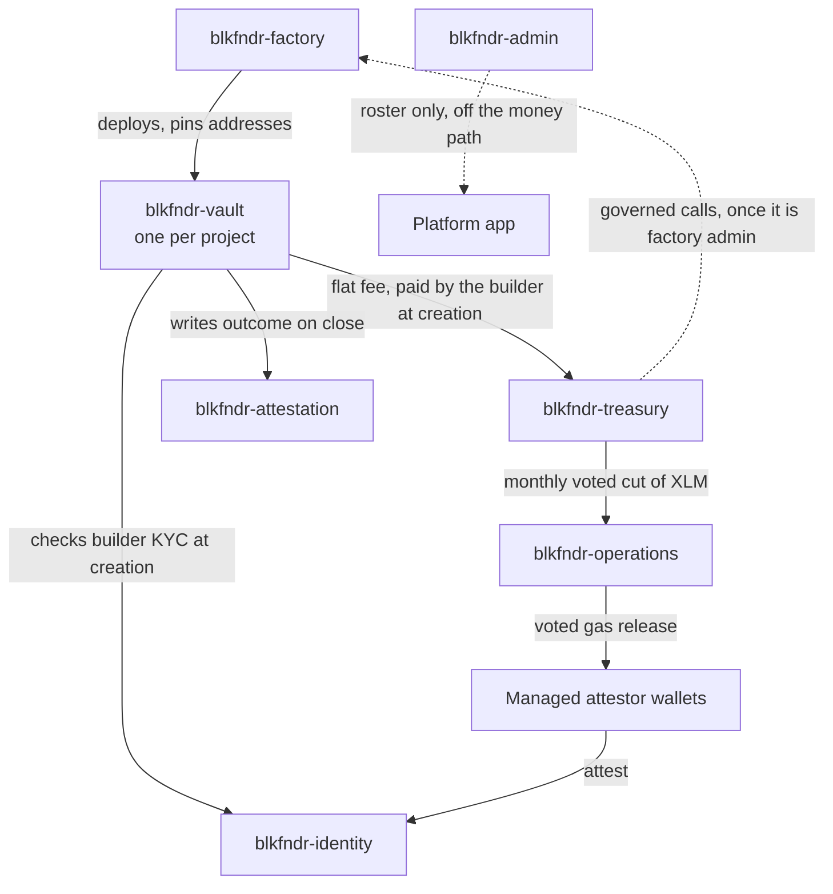

# Smart Contracts

blkfndr is a suite of seven Soroban contracts (Rust, compiled to WASM) on Stellar. The design has one governing idea: **no platform key sits anywhere in the path that moves money.** A project's funds live in a contract, not an account. Releases happen on a vote by the people with a stake in the project. The record of what happened is append-only. What the platform can do — set fees, review KYC, moderate listings — is kept out of the contracts that hold value.

The source lives in [contracts/](../contracts). TypeScript bindings for every contract are generated from that source into `src/packages/`. Wasm is built with `bash scripts/build-contracts.sh`.

> **Source is not the same as testnet.** A Soroban contract changes only when it is redeployed, and a vault change reaches only vaults the factory creates after `update_wasm_hash`. This page documents the source on `main` and says where the deployed contracts differ. See [Deployed vs source](#deployed-vs-source).

## The suite

| Contract | Responsibility | Holds value? |
|---|---|---|
| `blkfndr-vault` | Per-project vault: stakes, the builder's bond, stake-weighted milestone voting, refunds, forfeiture | **Yes** — one instance per project |
| `blkfndr-factory` | Deploys vaults from one wasm hash and pins the platform addresses each vault trusts | No |
| `blkfndr-attestation` | Append-only builder completion record. No update and no delete entrypoint exists | No |
| `blkfndr-identity` | KYC attestation registry. Named attestors write approvals | No |
| `blkfndr-admin` | Platform-administrator roster. **Not in the path that releases funds** | No |
| `blkfndr-treasury` | Platform fee treasury and owner-voted governance (fee, bond, shareholders, ops-funding cut) | **Yes** — pooled fees only |
| `blkfndr-operations` | Operations Vault: the governed gas budget for moderation. Holds no project funds | **Yes** — gas only |

### How they relate


```mermaid
graph TB
    F[blkfndr-factory] -->|deploys, pins addresses| V[blkfndr-vault<br/>one per project]
    V -->|flat fee, paid by the builder at creation| T[blkfndr-treasury]
    V -->|writes outcome on close| A[blkfndr-attestation]
    V -->|checks builder KYC at creation| I[blkfndr-identity]
    T -.->|governed calls, once it is factory admin| F
    T -->|monthly voted cut of XLM| O[blkfndr-operations]
    O -->|voted gas release| MW[Managed attestor wallets]
    MW -->|attest| I
    ADM[blkfndr-admin] -.->|roster only, off the money path| APP[Platform app]
```

A vault trusts only the addresses the factory pinned into it at creation, so a project cannot be pointed at a different fee wallet or identity registry after the fact. The factory's admin can be handed to the treasury, which puts fee and policy changes behind an owner vote rather than one signature. **That handover has not happened on testnet:** the live factory's admin is still the deployer key `GDR4TPUF…`, so a carried treasury proposal that calls the factory cannot execute yet.

## Deployed to testnet

Since the registry redeploy (deployed 2026-10-06, live in the app 2026-10-07), every contract on testnet runs the current source.

| Contract | Address | Running |
|---|---|---|
| Factory | [`CBRUIRJX…D3QSAHPLINO`](https://stellar.expert/explorer/testnet/contract/CBRUIRJXRU6NGHOSF5KMPUOFIXIANCPI43QC6JX2PKNOKD3QSAHPLINO) | Current source (wasm `eb20ce0f…`). Its first project id is 12 |
| Attestation registry | [`CDEN2LU4…72KIXSPSQFX`](https://stellar.expert/explorer/testnet/contract/CDEN2LU4M4SDSOWGU7JM5A46M3M2YSEKRLJ75PCNTFMPY72KIXSPSQFX) | Current source (`66f73252…`) |
| Identity registry | [`CAILTHEY…KUWHZ4FDHQ3`](https://stellar.expert/explorer/testnet/contract/CAILTHEYMBPUPQ2OM5KXTE2QKOTDRQEMIL3UAKWFMA2EWKUWHZ4FDHQ3) | Current source (`a0574873…`) |
| Admin roster | [`CAKANFZH…HHC6KCKJAAB`](https://stellar.expert/explorer/testnet/contract/CAKANFZHW6IYUNDNJMWJ3YNPZNHSSPF4CTOXKO55DBWOXHHC6KCKJAAB) | Current source (`00ebfb91…`) |
| Treasury | [`CAGMEGMS…NRO3TQPZW`](https://stellar.expert/explorer/testnet/contract/CAGMEGMS6MS6ENADUWDRW3GQ4XRBDYFFKHMRFVDEBHFCZW7NRO3TQPZW) | Current source (`3dc2b67d…`), built against the factory above |
| Operations Vault | [`CCVXM3YP…NQG7FDSN`](https://stellar.expert/explorer/testnet/contract/CCVXM3YPPEMWG4INHFTZ4NBJ3PQW3ZUNYIZMBJBNYQOMSNOENQG7FDSN) | Current source (`08360ea4…`), redeployed 2026-09-28. It references neither the factory nor the treasury, so the redeploy left it alone |

The factory is the source of truth for the others: its `get_fee_wallet`, `get_identity_registry` and `get_attestation_registry` return the treasury, identity and attestation addresses above. The app reads the treasury from `get_fee_wallet` rather than from configuration, so repointing fees repoints the app.

### The registry redeploy

Deployed from the admin key `GDR4TPUF…` with `scripts/deploy-contracts.sh --first-project-id 12 --shareholders-from <previous treasury> --roster-admins … --attestors …`. The IDs are in [deployments/testnet-production/contracts.env](../deployments/testnet-production/contracts.env).

- **Project ids continue at 12.** The previous factory issued #1–#11, and `projects.project_id` is unique.
- **Carried over:**
  - the treasury's three shareholders (3,334 / 3,333 / 3,333 bps);
  - the roster admins `GC64IPJE…` and `GDUIQFAO…`;
  - the app's managed attestor key `GCLH73GF…`. The previous registry's test attestor was not carried over.
- **KYC.** The 3 approved builders were copied in with [migrate-kyc.mjs](../scripts/migrate-kyc.mjs), each with the same hash it held in the previous registry.
- **Verified read-only:**
  - every wasm fetched from testnet matches a local build;
  - every setting reads back as intended;
  - a simulated launch by a migrated builder deployed a vault and paid the fee to the new treasury.

| Step | Transaction |
|---|---|
| Identity registry, then its attestor | [`92a6b4a9…`](https://stellar.expert/explorer/testnet/tx/92a6b4a948a9c4b0c255b34e4298b4e14b346b562d2e33084c384e9eb6ce78bb), [`c50bfebd…`](https://stellar.expert/explorer/testnet/tx/c50bfebd7aa88f9352809c5b9fc5a41ff31bb54a6963c20efa3c7ae30c3a47d3) |
| Admin roster, then its two admins | [`53915c00…`](https://stellar.expert/explorer/testnet/tx/53915c0046a897c0496d352213819d959529327ae69ed1d891adb1afc9def460), [`8831387c…`](https://stellar.expert/explorer/testnet/tx/8831387c49c72ec95efeb26ba3b6ed5ece9030ef48e5c61a1edd74c0f36be4be), [`d39aa1fb…`](https://stellar.expert/explorer/testnet/tx/d39aa1fb1dba232a1ff311a6481f0721cd8ef92b21e623c8656a3e1777802391) |
| Attestation registry | [`e091a145…`](https://stellar.expert/explorer/testnet/tx/e091a1454026a5a8c712804ba9e36237200f929a6717521e062c00f96056ef09) |
| Factory, then `add_factory` | [`f710c938…`](https://stellar.expert/explorer/testnet/tx/f710c938e959699818de333a85d3aabe5782714806ffbab05008f7eec8b3d064), [`3fe80ddf…`](https://stellar.expert/explorer/testnet/tx/3fe80ddf8a2fee199fdaad7aaae87e5e67b1881c7b33f09179c5e7594a026c30) |
| Treasury, then `update_fee_wallet` | [`60533728…`](https://stellar.expert/explorer/testnet/tx/60533728f7b30442d42496bbf632974cc850a47c579d3c1981e68996ffb8c88f), [`485577bd…`](https://stellar.expert/explorer/testnet/tx/485577bd954c1f8585ba3943abdd451747f62af023259f97675c1f1791fc9717) |
| KYC migration (3) | [`fc9d3fe7…`](https://stellar.expert/explorer/testnet/tx/fc9d3fe76f22ee9a3ab3c5e3c1dc1c686da64fc2fdd49eac11713d7cc96ec3d1), [`40091221…`](https://stellar.expert/explorer/testnet/tx/40091221b3613b682ce88a15e109175a19480cfd7b839b305d611868ef70b92b), [`8dfc13c4…`](https://stellar.expert/explorer/testnet/tx/8dfc13c40bd2cf09ec177f812a76579d46d8209d0fdc00c9caf86aca662577e6) |
| Previous factory closed to new launches | [`311abe5e…`](https://stellar.expert/explorer/testnet/tx/311abe5e1d7a8b5ebb74de9f9d43d55d2fe2fc6c93c7b125d303f05eab5dbd32) |

### Previous set: projects #1–#11

A vault keeps the addresses pinned into it at creation, so projects #1–#11 still run on the previous set:

| Contract | Address | Now |
|---|---|---|
| Factory | [`CDIXGE5M…F7BGKR7D5`](https://stellar.expert/explorer/testnet/contract/CDIXGE5MWFAYXA7FKLB4CDRSSQZ6VQSGHT6O6OY3TFTWVF6F7BGKR7D5) | Closed to new launches: its identity registry points at itself, so `create_vault` fails at the KYC check. It still answers `is_vault` when one of its vaults writes its record |
| Attestation registry | [`CDLL2A4R…JSNB2SO7`](https://stellar.expert/explorer/testnet/contract/CDLL2A4RBSQPKSPTEE3O4HNSDICSJEGCHAWIGUYVRPGOKVEPJSNB2SO7) | Receives the records of projects #1–#11 as they close. Older build, records keyed by project id |
| Identity registry | [`CCDBWBFE…RWZT27TGW`](https://stellar.expert/explorer/testnet/contract/CCDBWBFEK3YVXD2CDTJ4NFDPO7DB3OLB4YVX7BZI22M7QM4RWZT27TGW) | No longer consulted: a vault checks KYC only when it is created |
| Admin roster | [`CAHAOAX5…AU6WAGOG`](https://stellar.expert/explorer/testnet/contract/CAHAOAX52JAQ75C3INJIDVKT7EITWDVPYP2K27NJTD4CPYZUAU6WAGOG) | No longer read by the app |
| Treasury | [`CDA5XDY5…M44COAXU`](https://stellar.expert/explorer/testnet/contract/CDA5XDY564RV2OSZNF2S6CXQYCABFASBOHUCXJEGII6M232VM44COAXU) | Superseded. It holds 2,100 base units (0.00021 USDC) of fees, written off |

The keep-alive keeps the previous factory and attestation registry alive for as long as a vault depends on them. A builder's record is split as a result: projects #1–#11 are in `CDLL2A4R…`, and later projects in `CDEN2LU4…`.

### Reference deployment

A second, standalone set runs the current source, except that its factory predates the starting project id. It was deployed on 2026-10-06 with `scripts/deploy-contracts.sh`, the first live run of the #75 constructor deploy order. The app and its indexer do not use it, and it shares nothing with the sets above. Every on-chain wasm hash-matches a local build. Test transactions for deposits, threshold approval, release, refunds, bond forfeiture and attestation are recorded in [the deliverable evidence](deliverables/contribution-threshold-attestation.md).

| Contract | Address |
|---|---|
| Factory | [`CBYDZWQQ…RYHXEV3ZK6`](https://stellar.expert/explorer/testnet/contract/CBYDZWQQLVJJZCVLNR4VDXAO42CSQECKYYOL5ONUGYUYS5RYHXEV3ZK6) |
| Attestation registry | [`CDKERKLK…HLO2PI4UG`](https://stellar.expert/explorer/testnet/contract/CDKERKLK54FF4Y5OU7NIULEZZHY424OPFZ5FHMYNL24JGZVHLO2PI4UG) |
| Identity registry | [`CBOWJT4X…4EJN2FDTZH`](https://stellar.expert/explorer/testnet/contract/CBOWJT4XKEOA4IAA675FG6K67V3UVN7ESN6M4HPUEQSGRC4EJN2FDTZH) |
| Admin roster | [`CAT4WDHO…KOPIMH6JXR`](https://stellar.expert/explorer/testnet/contract/CAT4WDHO4SE3OVJIJU6RHNFIMDKHWIJCZCKQFMZ5E7YA32KOPIMH6JXR) |
| Vault wasm | `e9009410b9cbb4c5bfb7cca747812dcad6a044d09c648a1e392a84fe7e182d95` |

The IDs are in [deployments/testnet-reference/contracts.env](../deployments/testnet-reference/contracts.env).

### Deployed vs source

| Contract | What testnet runs | Source on `main` adds |
|---|---|---|
| Vault | wasm `e9009410…` for projects created since 2026-10-06: the current source, with the #99 release rule and the money majority. Projects created since the hardening redeploy (#71) run `70e5f3a8…`, and older ones `9c20bca3…` | Nothing |
| Factory, attestation, identity, admin, treasury | Current source, deployed 2026-10-06 | Nothing |
| Operations | Current source (wasm `08360ea4…`) | Nothing |

Every contract's wasm, fetched from testnet, hash-matches a local build of `main`. The [previous set](#previous-set-projects-111) still serving projects #1–#11 is the older build: `initialize` rather than a constructor, attestation records keyed by project id, and no `disable_factory`, `bump_kyc` or `bump_attestor`.

### The vault wasm hash

The vault is **not** deployed as a contract of its own. Its wasm is uploaded once and the factory instantiates one instance per project from that hash. Since 2026-10-06 the factory deploys:

```
blkfndr_vault.wasm  sha256:e9009410b9cbb4c5bfb7cca747812dcad6a044d09c648a1e392a84fe7e182d95
```

The factory admin switched it from `70e5f3a8…` with `update_wasm_hash` in transaction [`9dd7ed93…`](https://stellar.expert/explorer/testnet/tx/9dd7ed938ad0ef0db7e357cc6567e70c1620abb296a7baa301932888d7a13508). It is the vault on `main`, with the #99 release rule and the money majority, and the same code the [reference deployment](#reference-deployment) runs. Existing vaults are immutable and keep the code they were created with (see [Older vaults](#older-vaults)).

The factory has no getter for this hash. [src/lib/factory-vault-hash.ts](../src/lib/factory-vault-hash.ts) reads it from the factory's instance storage, and `/api/vault-wasm-hash` serves it (cached five minutes) to the homepage's "Check it yourself" box.

A build of `main` does not have one canonical hash. The wasm embeds absolute cargo-registry paths in panic locations, so the hash depends on the machine that built it (the checkout directory does not matter). `e9009410…` is the maintainer's build. Another machine will likely produce a different value. Compare a deployed vault against a build made on the same paths, or against the hash the factory reports.

## Platform parameters

Read from the live factory on 2026-10-07 (`stellar contract invoke --send=no`, read-only). Amounts are in base units of the project's token: 1 unit = 10,000,000 base units (7 decimals). A project is denominated in USDC or XLM.

| Parameter | Factory getter | Live value |
|---|---|---|
| Flat platform fee | `get_platform_fee` | 10,000,000 (1 unit of the project's token) |
| Minimum contribution | `get_min_contribution` | 50,000,000 (5 units) |
| Milestone voting window | `get_voting_window` | 604,800 s (7 days) |
| Minimum bond | `get_bond_percentage` | 500 bps (5% of the goal) |
| Factory admin | `get_admin` | `GDR4TPUF…` (the deployer key, not the treasury) |
| Last project id issued | `get_project_count` | 11, so the next project is #12 |

The previous factory charged 300 base units, almost certainly a leftover from the earlier percentage model (300 bps = 3%). Changing the fee needs `update_platform_fee` from the factory admin, or a treasury `SetFee` vote once the treasury is the factory admin.

## Storage lifetime

Soroban charges rent. Every contract instance, persistent entry and uploaded wasm lives until its TTL runs out, then it is archived and must be restored, and paid for, before anything can use it.

- The vault, factory, attestation, identity and admin contracts extend their own instance to ~30 days (`LEDGERS_TO_LIVE = 518_400`) on every mutating call, and extend persistent entries when they write them.
- The treasury and Operations Vault extend their instance to ~7 days (`LEDGER_BUMP = 120_960`) when fewer than ~1 day remains.
- Idle shared entries therefore expire. The vault wasm, unused for weeks after its upload, once made every launch pay to restore it.

[src/lib/ttl-keeper.ts](../src/lib/ttl-keeper.ts) keeps the shared entries alive. The `keep-alive-cron` compose service calls `POST /api/keep-alive` daily. It restores anything archived and tops up anything under 40 days to 60. The contracts' own `extend_ttl(518_400, 518_400)` tops an entry up to 30 days whenever a call finds less than that left, charging the caller for every day since the last top-up, so the keeper keeps the shared entries above 30 days. It covers the factory, both registries, the admin roster, the treasury, the Operations Vault and the vault wasm the factory deploys. It also reads every vault in the database and keeps what each runs on: its code, and the factory and attestation registry pinned into it. Older projects stay covered after the factory moves to newer code or new registries. Before this, `70e5f3a8…` and `9c20bca3…` dropped off the list. Restoring and extending are permissionless; the configured key only pays the fee. Per-project vault instances are not on the list: each is extended by its own calls, and its rent belongs to the project.

---

## blkfndr-vault

One vault per project. It holds every stake and the builder's performance bond in the same contract, runs the milestone votes that release money, and returns money when a project misses its goal, fails a milestone or is abandoned. **56 tests.**

### Lifecycle

`VaultState`: `Raising` → `Funded` → `Active` → `Completed`. `Failed` (goal missed) and `Refunding` (milestone failed, or project abandoned) are the branches that return money.

| From | To | Trigger |
|---|---|---|
| `Raising` | `Funded` | A contribution reaches the goal, or the deadline passes with the goal met |
| `Raising` | `Failed` | The deadline passes short of the goal (`settle`) |
| `Funded` / `Active` | `Active` | A milestone is released and others remain |
| `Funded` / `Active` | `Completed` | The last milestone is released |
| `Funded` / `Active` | `Refunding` | `settle_lapsed_milestone` or `settle_stalled` |

`get_state` is a true read. It reports the state the vault should be in (for example `Failed` once a deadline has passed) without writing anything. Each mutating entrypoint persists any pending transition first.

### Configuration

```rust
struct VaultInitConfig {
    project_id: u64, creator: Address, token: Address,
    goal: i128, deadline: u64, bond_amount: i128,
    identity_registry: Address, attestation_registry: Address,
    factory: Address, fee_wallet_address: Address,
    platform_fee: i128, voting_window_secs: u64,
    min_contribution: i128, milestones: Vec<MilestoneInput>,
    metadata_cid: String,
}
struct MilestoneInput { id: u32, amount: i128 }
```

`initialize` refuses a config unless the goal is positive, the deadline is in the future, the voting window is non-zero, the minimum contribution is positive, there are 1 to 20 milestones (`MAX_MILESTONES`) with unique ids and positive amounts, and the amounts sum exactly to the goal. The builder must be KYC-approved in the identity registry.

### Entrypoints

| Function | Who | Effect |
|---|---|---|
| `initialize(config)` | Factory, inside `create_vault` | Requires the factory's and the builder's auth. Takes the bond into the vault and the flat fee to the fee wallet, both from the builder, in the same transaction. Opens the raise |
| `contribute(contributor, amount)` | Anyone | Adds a stake. `amount ≥ min_contribution`, before the deadline, and never past the goal. No fee is deducted. Reaching the goal closes the raise. Contributors are not identity-gated; only the builder is KYC-checked |
| `settle()` | Anyone | Persists the deadline transition. A failed raise writes a `FailedToFund` record |
| `return_bond()` | Anyone | Returns the bond to the builder after a failed raise |
| `open_milestone_vote(id)` | Builder | Opens the fixed voting window on one milestone, once |
| `approve_milestone(contributor, id)` | Contributor | Casts the contributor's capped weight for the milestone, once, inside the window, and counts their whole stake toward the money majority |
| `release_milestone(id)` | **Anyone** | Pays a carried milestone to the builder. Inside or after the window. The last release also returns the bond and writes a `Completed` record |
| `settle_lapsed_milestone(id)` | Anyone | After the window, fails a milestone that did not carry. Forfeits the bond and moves to `Refunding` |
| `settle_stalled()` | Anyone | After 90 days with no release since funding or the last release (`BUILDER_STALL_WINDOW`), and with no milestone window open, fails the first unreleased milestone. Forfeits the bond and moves to `Refunding` |
| `claim_refund(contributor)` | Contributor | In `Failed`: the whole stake back. In `Refunding`: a pro-rata share of the unreleased funds plus the forfeited bond. The last claimant sweeps rounding dust |

Reads: `get_state`, `get_info`, `get_balance(contributor)`, `get_contributors(offset, limit)` (clamped to `MAX_PAGE = 100`), `contributor_count`, `get_voting_weight(contributor)`, `has_voted(id, contributor)`, `get_milestone_vote(id)`, `get_milestone_wallets(id)`, `get_milestone_stake(id)`.

- `get_milestone_vote(id)` returns `(approved_weight, required_weight, window_open)`. `required_weight` is `floor(capped total / 2) + 1`.
- `get_milestone_wallets(id)` returns `(approving_wallets, required_wallets)`. It rejects an unknown milestone id.
- `get_milestone_stake(id)` returns `(approved_stake, required_stake)`: what the approvers put in between them, counted whole, and `floor(raise / 2) + 1`. It rejects an unknown milestone id.

### The release rule

A milestone carries when **all three** of these hold:

1. **Weight.** The approving weight is more than half of the **capped total**: `approved × 10_000 > capped_total × 5_000` (`RELEASE_THRESHOLD_BPS`, strict, so a tie does not carry).
2. **Wallets.** At least three distinct wallets have approved, or every contributor when there are fewer than three (`MIN_APPROVING_WALLETS = 3`).
3. **Money.** The approvers put in more than half the raise between them, each stake counted whole: `approved_stake × 10_000 > raise × 5_000`.

The terms:

- **Weight cap.** A wallet's weight is its balance, capped at 20% of the raise: `cap = floor(raised × 2_000 / 10_000)` (`WEIGHT_CAP_BPS`). The cap is a fifth of the raise, not of the capped total, so it is fixed once the raise closes.
- **Capped total.** The sum of every contributor's weight after the cap. When nobody is over the cap, it equals the raise.
- **How it is computed.** The vault tracks the four largest balances (`DataKey::Largest`). At most four balances can exceed a fifth of the raise, since five would sum to more than the raise. So the capped total is the raise less the excess of those four over the cap. No call walks the contributor list.
- **Counting wallets.** `DataKey::ContributorCount` counts distinct contributors, and `DataKey::Approvals(id)` counts distinct approving wallets per milestone.
- **Counting money.** `DataKey::ApprovedStake(id)` sums the approvers' uncapped stakes per milestone. It is kept outside `Milestone` so that struct's shape, and every binding that decodes it, is unchanged.

The raise, the balances and the capped total are fixed while a vote runs. Contributions close when the goal is met, and refunds open only once the vault leaves `Funded`/`Active`.

Worked shapes, all on a 300 raise. The money condition changes none of these outcomes:

| Stakes | Capped total | Bar | Result |
|---|---|---|---|
| 100 / 100 / 100 | 180 | > 90 | Two wallets (120) clear the weight but not the floor. All three release |
| 200 / 50 / 50 | 160 | > 80 | The 200 backer plus one other (110) is blocked by the floor. All three release |
| 300 (one backer) | 60 | > 30 | One vote releases |
| 250 / 50 | 110 | > 55 | Both must approve |

What this guarantees, with the tests that pin it:

- **A vote every contributor approves always carries.** Concentration never deadlocks a vault. `a_sole_backer_releases_with_one_vote`, `two_backers_release_when_both_approve`, `a_concentrated_raise_releases_when_every_backer_approves`, and `a_unanimous_vote_always_carries` across five skewed raises.
- **No release is carried over a dissenting contributor by fewer than three wallets,** and a dominant contributor cannot release alone. `a_majority_contributor_cannot_release_alone`, `release_requires_at_least_three_distinct_wallets`, `a_concentrated_raise_carries_without_its_last_backer`.
- **No release carries with a minority of the money behind it,** however many wallets it is split across. `small_wallets_cannot_outvote_most_of_the_money`, `a_majority_holder_can_block_a_release_but_never_make_one_alone`, `a_minority_of_the_money_no_longer_carries_over_capped_backers`.
- **The capped total is computed correctly** without walking contributors. `a_late_whale_is_counted_in_the_capped_total`, `the_capped_total_matches_a_direct_sum`.
- **Silence returns money, never releases it.** A lapsed window fails the milestone and makes funds claimable. It can never pay the builder. `silence_never_releases_funds`, `a_window_that_met_threshold_cannot_be_declared_failed`.

**Trade-off.** A wallet holding more than half the raise can block a release, though it can never make one alone. It could do the same under the original raw-raise bar. The cap and the floor count wallets, not people, because contributions are not identity-gated (M-01 in [progress.md](../progress.md)). The money condition is what keeps that from mattering for a release.

### Sybil wallets against a large backer (resolved)

Found in the adversarial review of #99. The product owner adopted the fix on 2026-10-06. It runs in every vault created since the factory switched to `e9009410…` that day.

- **The attack.** Raise 1,000. One honest backer puts in 790, capped at 200. The builder puts 70 into each of three fresh wallets (210). The capped total is 410, so the weight bar is more than 205, and the three wallets clear it and the floor. Likewise 60/10/10/10/10 let four small wallets override a 60% holder, and three wallets of 140 (42%) outvoted two backers of 290, who count for 200 each.
- **The fix: a dual majority.** The approvers' uncapped stakes must also exceed half the raise (condition 3 above). In each case above the approvers hold 21%, 40% or 42% of the money, so nothing moves. Unanimity still always carries, and every worked shape above keeps its outcome.

### Known issue in deployed vaults

Two fixes from the #99 review were pushed to its branch 17 minutes after it merged, in commit `d212b37`, and have since landed on `main`. The tests `a_carried_vote_cannot_be_stalled_out` and `a_tiny_raise_still_releases_when_every_backer_approves` pin them. They run in vaults created since the factory switched to `e9009410…` on 2026-10-06:

- **`settle_stalled` spares a carried milestone**, as `settle_lapsed_milestone` already did.
- **The weight cap never drops below one base unit**, so a raise under five base units still releases when every backer approves. The live 5-unit minimum contribution already makes such a raise impossible.

Every vault created before the switch, including those from `70e5f3a8…`, keeps the first defect: **`settle_stalled` can fail a carried milestone.** It refuses only while a window is open. Opening a vote does not reset the 90-day stall clock. So once a carried milestone's window closes unreleased, and 90 days have passed since funding or the last release, anyone can call `settle_stalled`, fail that milestone and forfeit the bond of a builder whose work was approved. The platform's `settle-stalled-cron` submits `settle_stalled` for any vault where it would succeed. Releasing a carried milestone promptly avoids it.

### Older vaults

Vaults are not upgradeable. Vaults created from `70e5f3a8…` (and the earlier `9c20bca3…`) measure the bar against the **raw raise**: a release needs approving capped weight above `floor(raise / 2) + 1`, with no wallet floor and no money majority. They expose neither `get_milestone_wallets` nor `get_milestone_stake`, and the UI treats each missing-function error as "older rule". Under that rule a raise with one or two backers, or any raise whose capped weights sum to half the raise or less (for example 210/50/40 on 300), can never release, and its milestones can only lapse. `9c20bca3…` vaults also predate `settle_stalled`.

### Storage keys

| Key | Storage | Holds |
|---|---|---|
| `State`, `Info` | Instance | Lifecycle state and `ProjectInfo` (config, milestones, totals, bond flags) |
| `LastActivity` | Instance | When the vault was funded or last released. The stall clock |
| `Largest` | Instance | The four largest balances |
| `ContributorCount` | Instance | Distinct contributors |
| `Approvals(id)` | Instance | Distinct approving wallets per milestone |
| `ApprovedStake(id)` | Instance | The approvers' uncapped stakes per milestone |
| `ContributorBalance(addr)` | Persistent | Each contributor's stake. Removed on refund |
| `Contributors` | Persistent | The contributor list, for paging |
| `Vote(id, addr)` | Persistent | Whether a contributor approved a milestone |

### Events

| Topic | Data |
|---|---|
| `VAULT INIT` | project id, metadata CID |
| `BOND POSTED` | project id, bond |
| `DEPOSIT CONTRIB` | project id, contributor, amount, raised total |
| `VAULT FUNDED` / `VAULT FAILED` | project id, raised total |
| `MILESTN VOTEOPEN` | project id, milestone id, opens at, closes at |
| `MILESTN APPROVE` | project id, milestone id, contributor, weight, running weight |
| `MILESTN RELEASE` | project id, milestone id, tranche, released total |
| `MILESTN FAILED` | project id, milestone id, approved weight, raised total |
| `VAULT STALLED` | project id, last activity |
| `BOND RETURNED` / `BOND SLASHED` | project id, bond |
| `DEPOSIT REFUND` | project id, contributor, amount |

The indexer ([src/lib/event-indexer.ts](../src/lib/event-indexer.ts)) treats every vault event as a signal to re-read the vault, not as the source of its numbers.

### Errors

`NotAuthorized` 1, `InvalidStatus` 2, `InsufficientFunds` 4, `GoalAlreadyReached` 5, `InvalidConfiguration` 6, `FundingDeadlinePassed` 7, `NoFundsToRefund` 9, `AlreadyInitialized` 10, `NotInitialized` 11, `KYCInvalid` 12, `MilestoneNotFound` 13, `MilestoneAlreadyReleased` 14, `VotingNotOpen` 15, `VotingAlreadyOpen` 16, `VotingClosed` 17, `AlreadyVoted` 18, `NotAContributor` 19, `ThresholdNotMet` 20, `ThresholdMet` 21, `VotingWindowNotElapsed` 22, `MilestoneFailed` 23, `BelowMinimumContribution` 24, `NotStalled` 25.

---

## blkfndr-factory

Deploys vaults and is the single place that decides what code a vault runs and which platform addresses it trusts. It has no role in moving money: it cannot release a tranche, block a refund or touch a vault's balance. **17 tests** (seven of them deploy the compiled vault wasm and skip when it is absent).

| Function | Who | Effect |
|---|---|---|
| `__constructor(admin, vault_wasm_hash, fee_wallet, platform_fee, identity_registry, attestation_registry, voting_window_secs, min_contribution, first_project_id)` | Deployer, at deploy | Configures the factory inside the deploy transaction. The fee must be 0 to 10,000 units (`MAX_PLATFORM_FEE`), the window non-zero, the minimum contribution positive, and `first_project_id` at least 1. A replacement factory is given its predecessor's `get_project_count` + 1, so project ids never repeat: the app keys projects by them. The live factory was given 12. The previous factory took the same arguments, less `first_project_id`, through `initialize` |
| `create_vault(config)` | Builder | Checks the bond against the minimum, increments the project counter, deploys a vault from the pinned wasm hash, registers it with `is_vault`, then calls the vault's `initialize` with the factory-held addresses and parameters |
| `update_wasm_hash` / `update_fee_wallet` / `update_platform_fee` / `update_bond_percentage` / `update_identity_registry` / `update_voting_window` / `update_min_contribution` | Admin | Policy for **future** vaults. Existing vaults keep what they were created with |
| `transfer_admin(new_admin)` | Admin | Hands over factory admin, for example to the treasury |

```rust
struct CreateVaultConfig {
    creator: Address, token: Address, goal: i128, deadline: u64,
    bond_amount: i128, milestones: Vec<MilestoneInput>, metadata_cid: String,
}
```

A builder supplies no registry, fee wallet, fee, window or minimum. Those come from factory storage. The bond must be at least `goal × bond_bps / 10_000` (default 500 bps). The project id is the counter, which starts at `first_project_id`, and the vault's deploy salt is the SHA-256 of that counter.

Reads: `is_vault(address)`, `get_vault(project_id)`, `get_admin`, `get_fee_wallet`, `get_platform_fee`, `get_bond_percentage`, `get_identity_registry`, `get_attestation_registry`, `get_voting_window`, `get_min_contribution`, `get_project_count` (the last project id issued, which is the number of projects only for a factory that started at 1). There is no getter for the vault wasm hash (see [The vault wasm hash](#the-vault-wasm-hash)).

- **Storage keys:** `Admin`, `VaultWasmHash`, `ProjectCounter`, `FeeWalletAddress`, `PlatformFee`, `MinBondPercentage`, `IdentityRegistry`, `AttestationRegistry`, `VotingWindowSecs`, `MinContribution` (instance); `ProjectVaultMap(id)`, `IsVault(address)` (persistent).
- **Events:** `FACTORY INIT`, `FACTORY DEPLOY` (project id, vault, creator, metadata CID), `FACTORY UPGRADE`, `FACTORY WALLET`, `FACTORY FEE`, `FACTORY BOND_PCT`, `FACTORY IDENTITY`, `FACTORY VOTEWIN`, `FACTORY MINCONTR`, `FACTORY ADMIN_TX`.
- **Errors:** `NotAuthorized` 1, `NotInitialized` 11, `BondBelowMinimum` 12, `InvalidConfiguration` 13, `VaultNotFound` 14. Code 10 (`AlreadyInitialized`) is a reserved gap; the previous factory still uses it.

---

## blkfndr-attestation

An append-only record of every project a builder has closed. There is **no update entrypoint and no delete entrypoint**, and `attest` refuses to overwrite a record, so a bad outcome cannot be scrubbed before the next raise. **16 tests.**

A write needs the vault's own auth, a factory the registry trusts, and that factory's confirmation (`is_vault`) that the caller is one of its vaults. `MAX_FACTORIES = 16`, `MAX_PAGE = 100`.

| Function | Who | Effect |
|---|---|---|
| `__constructor(admin)` | Deployer, at deploy | Sets the admin and trusts **no** factory yet. The deployer adds the factory immediately afterwards with `add_factory`. That split is what lets the factory take this registry's address in its own constructor |
| `add_factory(factory)` | Admin | Trusts another factory's vaults to write, so a factory upgrade keeps one history |
| `disable_factory(factory)` | Admin | Stops a factory's vaults writing **new** records. Records already written stay readable |
| `attest(vault, factory, builder, project_id, outcome, total_raised, bond_posted, milestones_total, milestones_approved)` | A trusted factory's vault | Writes the record once, stamped with `closed_at` |
| `transfer_admin(new_admin)` | Admin | — |

`Outcome`: `Completed`, `FailedWithForfeiture`, `FailedToFund`. No fault attaches to the builder for `FailedToFund`.

Reads: `get_record(vault)`, `has_record(vault)`, `get_builder_vaults(builder)`, `get_builder_history(builder, offset, limit)`, `get_builder_summary(builder) -> (completed, failed_with_forfeiture, failed_to_fund)`, `get_factories`, `is_factory_trusted(factory)`, `get_admin`.

- **Storage keys:** `Admin`, `Factories` (instance); `Record(vault)`, `BuilderVaults(builder)` (persistent). Keyed by vault address, which is unique across factories (#73 H-07), and indexed by builder.
- **Events:** `ATTEST INIT`, `ATTEST FACTORY`, `ATTEST DISABLE`, `ATTEST ADMIN_TX`, and `ATTEST RECORDED` with topics `(ATTEST, RECORDED, builder)` and data `(vault, project_id, outcome, total_raised, bond_posted, milestones_total, milestones_approved, closed_at)`. The builder topic lets Soroban RPC `getEvents` filter to one builder. RPC keeps events for about a week; the record in storage is the permanent copy.
- **Reading from another contract.** Any contract can call `get_builder_summary` or `get_builder_history` and gate on the result. `another_contract_can_gate_on_a_builders_record` does this from a stand-in grant programme.
- **Errors:** `NotInitialized` 2, `NotAVault` 3, `AlreadyAttested` 4, `RecordNotFound` 5, `InvalidRecord` 6, `UntrustedFactory` 7, `FactoryAlreadyTrusted` 8, `TooManyFactories` 9, `FactoryNotTrusted` 10.

**The previous registry, which projects #1–#11 write to, is older.** It is configured by `initialize(admin, factory)`, keys records by `project_id` (`get_record(project_id)`, `has_record(project_id)`, `get_builder_projects`), has no `disable_factory` and so cannot stop trusting a factory, and keeps error 1 as `AlreadyInitialized`. Because project ids restart at 1 in every factory, a second trusted factory would collide with the first. It trusts only the previous factory, so the collision never arises there. The app's `attestationClient` binding follows the source; nothing in the app calls it today.

---

## blkfndr-identity

The KYC gate. Named attestors write approvals, and the vault checks the builder's at `initialize`. Contributors are not identity-gated on-chain, so the 20% cap and the three-wallet floor bind addresses, not people. **15 tests.**

KYC attestors sign from **managed, gas-only wallets**: the platform generates the key, keeps it in Supabase Vault and signs `attest` server-side when a human reviewer approves KYC in the console (see [Architecture](architecture.md)). An attestor key can only `attest` and `revoke`, and it never holds project funds. Appointing an attestor stays with the registry admin's own wallet, because that key also carries `transfer_admin`.

| Function | Who | Effect |
|---|---|---|
| `__constructor(admin)` | Deployer, at deploy | Sets the admin |
| `add_attestor(account)` / `remove_attestor(account)` | Admin | Appoints or removes an attestor. Removing one leaves the approvals they wrote in place |
| `attest(attestor, address, kyc_hash)` | Attestor or admin | Records an approval (a hash of the off-chain KYC record). Refuses if one exists |
| `revoke(attestor, address)` | Attestor or admin | Removes an approval |
| `transfer_admin(new_admin)` | Admin | — |
| `bump_kyc(address)` / `bump_attestor(account)` | Anyone | Extends an approval's or an attestor's TTL without changing it. Reverts if it does not exist |

Reads: `is_kyc_approved(address)`, `get_attestation(address)`, `is_attestor(account)` (true for the admin), `get_admin`. `is_kyc_approved`, `get_attestation` and an attestor's own calls re-extend the entry they read, so an approval in use does not archive.

- **Storage keys:** `Admin` (instance); `Attestor(address)`, `Attestation(address)` (persistent).
- **Events:** `IDENTITY INIT`, `IDENTITY ATTESTOR` (account, added), `IDENTITY ATTEST`, `IDENTITY REVOKE`, `IDENTITY ADMIN_TX`.
- **Errors:** `NotAuthorized` 1, `NotInitialized` 11, `AlreadyAttested` 12, `NotAttested` 13, `NotAnAttestor` 14, `AlreadyAnAttestor` 15.

**The previous registry is older:** `initialize(admin)`, and no `bump_kyc` / `bump_attestor` or re-extension on read (#73 M-02). Since the redeploy no vault consults it: a vault checks KYC only when it is created.

---

## blkfndr-admin

The platform-administrator roster, and nothing more. It holds no funds and gates nothing that moves money. **9 tests.**

| Function | Who | Effect |
|---|---|---|
| `__constructor(owner)` | Deployer, at deploy | Sets the owner, who is also the first admin |
| `add_admin(account)` / `remove_admin(account)` | Owner | Roster edits. The owner cannot be removed (`WouldOrphanRoster`) |
| `transfer_ownership(new_owner)` | Owner | Hands over ownership. The new owner is added as an admin if not one already |

Reads: `is_admin(account)`, `get_admins`, `get_owner`, `admin_count`.

- **Storage keys:** `Owner`, `Admins` (instance).
- **Events:** `ADMIN INIT`, `ADMIN ADDED`, `ADMIN REMOVED`, `ADMIN OWNER_TX`.
- **Errors:** `NotAuthorized` 1, `NotInitialized` 11, `AlreadyAnAdmin` 12, `NotAnAdmin` 13, `WouldOrphanRoster` 14.

Console access does not come from this contract. Since #88 the app asks the `platform_admins` roster in Postgres through `my_role()`. The admin views still read `get_admins` and `get_owner`. The previous roster was configured by `initialize(owner)`; the live one by its constructor.

---

## blkfndr-treasury

Where the flat listing fees pool, and the governance seat for the platform. Owners vote **two-thirds by headcount** (`APPROVAL 2/3`: two of three, three of four) to distribute the balance to shareholders and to set platform policy. Nobody, including the deployer, can move money on their own signature. **45 tests.**

On testnet the register is three owners at 3,334 / 3,333 / 3,333 bps, and the treasury governs factory `CBRUIRJX…`.

| Function | Who | Effect |
|---|---|---|
| `__constructor(deployer, factory, shareholders)` | Deployer, at deploy | Sets the factory it governs and the shareholder register, inside the deploy transaction. The factory address cannot be changed afterwards |
| `open_cycle(opener, token)` | Shareholder | Opens a distribution vote over the **unreserved** balance of one token, snapshotting the amount and the register |
| `approve_cycle(voter)` | Shareholder on the snapshot | One vote each. At two-thirds the cycle becomes payable and its amount is reserved |
| `settle_lapsed_cycle()` | Anyone | Marks a cycle that closed short as lapsed. Nothing is paid; the balance rolls into the next cycle |
| `claim(shareholder, cycle_id)` | Shareholder | Pulls their share of a payable cycle. The last claimant releases the rounding remainder back to the pool |
| `propose(proposer, action)` | Shareholder | Opens a policy proposal. Malformed actions are rejected up front |
| `approve_proposal(voter)` | Shareholder on the snapshot | One vote each |
| `execute_proposal()` | **Anyone** | Applies a carried proposal. Factory actions need the treasury to be the factory's admin |
| `fund_operations()` | **Anyone** | Moves the voted ops-funding cut to the Operations Vault, at most once per 30 days |

Distribution cycles are rate-limited to one carried release per **30 days** (`MIN_RELEASE_INTERVAL`), measured from the last cycle that carried. A carried cycle reserves its amount, so a later cycle can never pay an earlier shareholder's owed share to someone else. Votes stay open 7 days (`DEFAULT_VOTE_WINDOW`). Fees arrive in each project's own token, and each cycle settles one token, so no price oracle is involved.

`GovernedAction` — everything a vote can change:

| Variant | Changes |
|---|---|
| `SetFee(i128)` | The flat listing fee (factory `update_platform_fee`) |
| `SetBondBps(u64)` | The minimum bond, in basis points of the goal |
| `SetWasmHash(BytesN<32>)` | The wasm every **future** vault runs — the platform's upgrade lever |
| `SetFeeWallet(Address)` | Where fees go, including a replacement treasury |
| `SetIdentityRegistry(Address)` | Which registry vouches for builder identity |
| `SetVotingWindow(u64)` | How long milestone votes stay open |
| `SetMinContribution(i128)` | The smallest stake a vault accepts |
| `TransferAdmin(Address)` | Hands factory admin to someone else — the reversible escape hatch |
| `SetOwners(Vec<Address>)` | Replaces the owners with equal shares (10,000 bps split, remainder to the earliest) |
| `SetShareholders(Vec<Shareholder>)` | Replaces the register with a deliberate unequal split |
| `SetOpsFunding(OpsFundingTerms)` | The monthly cut routed to the Operations Vault |

The first eight call the factory, so they execute only once the treasury is the factory's admin. The live factory's admin is still the deployer key. The last three change the treasury itself and work today.

Ops funding, once voted, runs itself. `fund_operations()` is permissionless and 30-day-gated on its own clock. It moves `bps` of the **unreserved** balance of the configured token (XLM) to the Operations Vault, refuses while a distribution cycle is mid-vote, and never touches money owed to a shareholder. The `ops-funding` cron route calls it. `get_ops_funding` returns nothing on testnet today: the `SetOpsFunding` vote for the new Operations Vault has not been taken.

```rust
struct Shareholder { address: Address, share_bps: u32 }   // all shares total 10_000, at most 20
struct OpsFundingTerms { vault: Address, token: Address, bps: u32 }
```

Reads: `get_shareholders`, `get_cycle(id)`, `get_open_cycle`, `get_reserved(token)`, `get_available(token)`, `get_proposal`, `get_factory`, `has_claimed(cycle_id, shareholder)`, `balance_of(token)`, `next_release_at`, `get_ops_funding`, `next_ops_funding_at`, `ops_funding_available`.

- **Storage keys:** `Factory`, `Shareholders`, `VoteWindow`, `NextCycleId`, `OpenCycleId`, `LastReleaseAt`, `Proposal`, `NextProposalId`, `OpsFunding`, `LastOpsFundingAt` (instance); `Cycle(id)`, `Reserved(token)`, `ClaimCount(id)`, `CycleVote(id, addr)`, `Claimed(id, addr)`, `ProposalVote(id, addr)` (persistent).
- **Events:** `TREASURY INIT`, `CYCLE OPEN` / `APPROVE` / `PAYABLE` / `LAPSED` / `CLAIM`, `PROPOSAL OPEN` / `APPROVE` / `APPLIED`, `OWNERS SET`, `SHARES SET`, `OPSFUND SET`, `OPSFUND SENT`.
- **Errors:** `NotAuthorized` 1, `NotInitialized` 11, `NotAShareholder` 20, `SharesMustTotalBps` 21, `TooManyShareholders` 22, `DuplicateShareholder` 23, `ZeroShare` 24, `NoCycleOpen` 30, `CycleAlreadyOpen` 31, `NothingToRelease` 32, `AlreadyVoted` 33, `VotingClosed` 34, `ThresholdNotMet` 35, `ThresholdAlreadyMet` 36, `NotPayable` 37, `AlreadyClaimed` 38, `ReleaseTooSoon` 39, `NoProposalOpen` 40, `ProposalAlreadyOpen` 41, `FeeOutOfRange` 42, `OpsFundingNotSet` 43.

---

## blkfndr-operations

The Operations Vault: a governed pot of XLM that pays the gas for moderation (KYC attestation, project approval). It holds **no project funds**, only the platform's own gas budget. Owners are plain voters with no shares. They vote **two-thirds by headcount**, and execution is **permissionless**: the carried vote is the authority, and no owner key signs the transfer. **25 tests.**

| Function | Who | Effect |
|---|---|---|
| `__constructor(deployer, owners)` | Deployer, at deploy | Sets the owner set (1 to 20, `MAX_OWNERS`, no duplicates) inside the deploy transaction |
| `propose(proposer, action)` | Owner | Opens a proposal against a snapshot of the owners. One at a time; an expired or carried one does not block |
| `approve(voter)` | Owner on the snapshot | One vote each |
| `execute()` | **Anyone** | Clears the proposal, then runs it (checks-effects-interactions) |

`GovernedAction`:

| Variant | Effect |
|---|---|
| `Release(ReleaseTerms)` | Pay one destination |
| `ReleaseMany(Vec<ReleaseTerms>)` | Pay the managed-wallet roster in one carried vote, **all-or-nothing**, at most 50 entries (`MAX_RELEASE_BATCH`) |
| `SetOwners(Vec<Address>)` | Replace the owner set |
| `SetVotingWindow(u64)` | Change how long a proposal stays open (default 7 days) |

```rust
struct ReleaseTerms { token: Address, amount: i128, to: Address }
```

`ReleaseMany` is the monthly gas top-up to every active managed attestor wallet. A SAC `transfer` to a fresh classic address both creates and funds that account, so one carried vote can provision a new moderator's wallet directly from the vault.

Reads: `get_owners`, `is_owner(who)`, `get_proposal`, `vote_window`, `balance_of(token)`.

- **Storage keys:** `Owners`, `VoteWindow`, `Proposal`, `NextProposalId` (instance); `ProposalVote(id, addr)` (persistent).
- **Events:** `OPSVAULT INIT`, `PROPOSAL OPEN` / `APPROVE` / `APPLIED`, `OPSVAULT RELEASE`, `OPSVAULT RELEASES`, `OWNERS SET`, `OPSVAULT WINDOW`.
- **Errors:** `NotInitialized` 11, `NotAnOwner` 20, `TooManyOwners` 21, `DuplicateOwner` 22, `NoOwners` 23, `NoProposalOpen` 40, `ProposalAlreadyOpen` 41, `AlreadyVoted` 42, `VotingClosed` 43, `ThresholdNotMet` 44, `ThresholdAlreadyMet` 45, `InvalidAmount` 50, `InsufficientFunds` 51, `InvalidBatch` 52.

On testnet its owners are the treasury's three owners, with a 7-day window. The cutover is half done: the app points at `CCVXM3YP…`, but it holds 0 XLM, and the previous vault `CDZXCWKY…` still holds 25 XLM pending an owner vote (item 1 in [progress.md](../progress.md)).

`SetVotingWindow` is not validated. A carried vote for a window of 0 would make every later proposal close the moment it opens, and a window large enough to overflow the close time would make `propose` fail. Either way no vote could carry again, including one to change the window back.

---

## Governance model, in one place

Both value-governing contracts (treasury, operations) share the same spine:

- **Two-thirds by headcount, not by share.** Weighting by share made a majority holder's agreement necessary for anything to move. With equal shares, headcount is simpler and removes that veto. `carried(approvals, total) = approvals × 3 ≥ total × 2`.
- **Votes run against a snapshot.** A proposal or cycle records the register or owner set when it opens, so changing either mid-vote cannot move the threshold.
- **Permissionless execution.** A carried vote is the authority. Anyone can submit the execution, so there is no appointed signer to chase and no one who can sit on a decision the owners already made.
- **Bounded everything.** Owner sets, shareholder registers, batch releases and paged reads are capped so iteration stays inside one transaction's resource budget.
- **Votes expire.** An unfinished vote (7-day window) lapses and can be replaced, rather than pinning a balance forever.
- **Configured at deploy, never after.** Both take their owners or shareholders through a `__constructor` inside the deploy transaction, so neither is ever deployed-but-unconfigured. That closes the window in which a first caller could seize the contract and name itself the entire register (audit H-03).

## Building and verifying

```bash
bash scripts/build-contracts.sh   # compiles all seven, prints the sha256 of each wasm
cargo test --workspace            # the full test suite
cargo clippy --workspace --all-targets -- -D warnings
```

Run `build-contracts.sh` before `cargo test`. The factory's six deployment tests need the vault compiled to wasm and skip themselves when it is absent. On 2026-10-03 the suite passed in full: vault 52, treasury 45, operations 25, factory 15, identity 15, attestation 14, admin 9.

To check a vault, build on the same paths as the build you compare against (see [The vault wasm hash](#the-vault-wasm-hash)), or fetch the deployed code with `stellar contract fetch --wasm-hash <hash>` and compare that directly.
